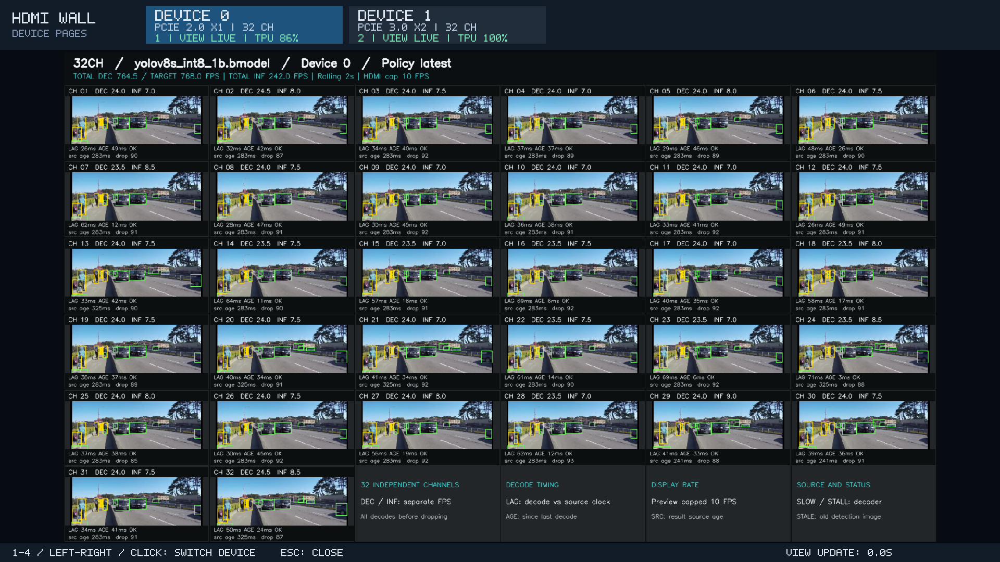

# RK3588 + BM1684X EP Demo

在 RK3588 Linux 主机上通过 PCIe 使用 BM1684X，提供视频检测、HDMI 多路视频墙、硬件解码与性能诊断。HDMI 展示支持选择 **1–4 张卡**，每卡路数可配置。

[环境准备](docs/setup.md) · [模型与素材](data/README.md) · [文档导航](docs/README.md) · [性能说明](docs/performance-overview.md)

## 运行 Demo

| 用途 | 入口 |
|---|---|
| 多卡 HDMI 视频墙、展示与压测 | [HDMI 视频墙](demos/hdmi_wall/README.md) |
| YOLOv8 单卡 / 多卡视频检测 | [YOLOv8](demos/yolov8/README.md) |
| YOLO26 单卡 / 多卡视频检测 | [YOLO26](demos/yolo26/README.md) |
| 单独检查硬件解码 | [解码 Demo](demos/decode/README.md) |
| 排查计算、回传与解码性能 | [诊断工具：按问题选择](tools/diagnostics/README.md) |

先按环境说明准备 SDK、模型和素材。以下命令在板端仓库根目录运行，设备编号以实际查询为准：

```bash
# 自动识别当前连接的 1–4 张卡，正式运行五分钟。
# 需要先配置 HDMI 显示环境，并确认所选设备空闲。
bash demos/hdmi_wall/showcase.sh --devices auto --streams 8 --duration 300 \
  --preview-fps -1 --display-fps 30

# 提前结束由该入口启动的任务。
bash demos/hdmi_wall/showcase.sh --stop
```

也可手动选择设备：`--devices 0`（单卡）、`--devices 0,1`（双卡）、`--devices 0,1,2`（三卡）、`--devices 0,1,2,3`（四卡）。这些编号仅作示例，可使用实际存在的不连续编号；一次只运行其中一种配置。`--streams 16` 可将每卡路数改为 16。

上面的命令使用每卡 8 路，取消单路预览限频，并将播放器刷新率设为 30 FPS；本轮每路预览提交约 24 FPS。16 / 24 路分别约 17–18 / 11–12 FPS；32 路约 7.5–8.7 FPS，保留多路展示用途，但达不到源视频 24 FPS 的流畅度。[4 / 8 / 16 / 24 / 32 路效果](demos/hdmi_wall/docs/layouts.md)。

showcase 默认采用线性解码输出、8 块额外缓冲、官方 1080p24 素材、每卡 8 路、预览不限频、播放器 30 FPS。复现旧吞吐配置须显式使用 `--streams 32 --preview-fps 3 --display-fps 10`；32 路用于容量展示，不代表每路达到源帧率。完整配置与素材限制见[运行说明](demos/hdmi_wall/docs/linear-materials.md)。

展示使用 `--mode showcase`（默认每卡 8 路、预览不限频）；固定负载压测使用 `--mode stress`（默认每卡 32 路、预览 3 FPS、提前 EOF 报错）。两者目的和验收指标不同，见[两种用途](demos/hdmi_wall/docs/showcase.md#两种用途)。

## 已记录的测试结果

2026-09-29，三卡各 32 路、每卡正式 300 秒：两张 PCIe2 ×1 卡分别为 **278.10 / 280.91 FPS**，一张 PCIe3 ×1 卡为 **281.09 FPS**。96 路都有检测结果，卡 0 有年龄超限丢帧。详见[三卡测试记录](demos/hdmi_wall/docs/three-card.md)。

这些是每卡全部通道合计的检测速度，平均每路约 8.7–8.8 FPS；各通道独立读取同一本地视频。三卡结果只代表本次配置；四卡尚未上板验证，不能按单卡结果直接相乘。五分钟测试不代表四小时稳定性或独立网络摄像头验收。[指标解释](docs/performance-overview.md) · [完整数据与历史对照](demos/hdmi_wall/docs/current-data.md) · [线性输出优化机制](docs/vpp-root-cause.md)

## HDMI 画面



上图为历史双卡界面，不是本次三卡测试截图。各卡分页显示，切页时其他卡继续处理。截图来源见[素材与历史记录](demos/hdmi_wall/docs/results.md#截图素材)。

## 目录

`demos/` 保存运行入口与源码，`tools/diagnostics/` 保存诊断工具，`scripts/` 准备资源，`docs/` 保存共享说明与调查报告。模型、视频、SDK 和完整日志放在本地 `data/`，不随 Git 分发。历史实验和复算工具通过文档索引查阅。

官方参考：[SOPHON 示例](https://github.com/sophgo/sophon-demo) · [开发资料](https://developer.sophgo.com/site/index/material/all/all.html)
