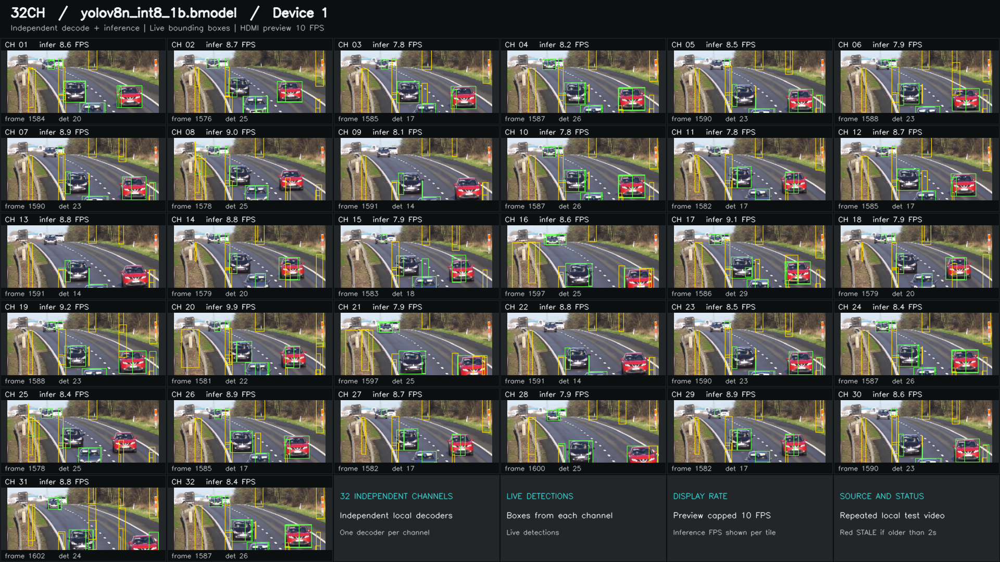
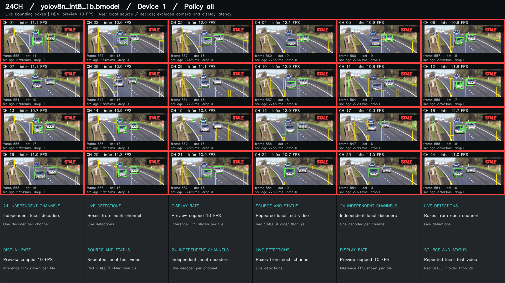
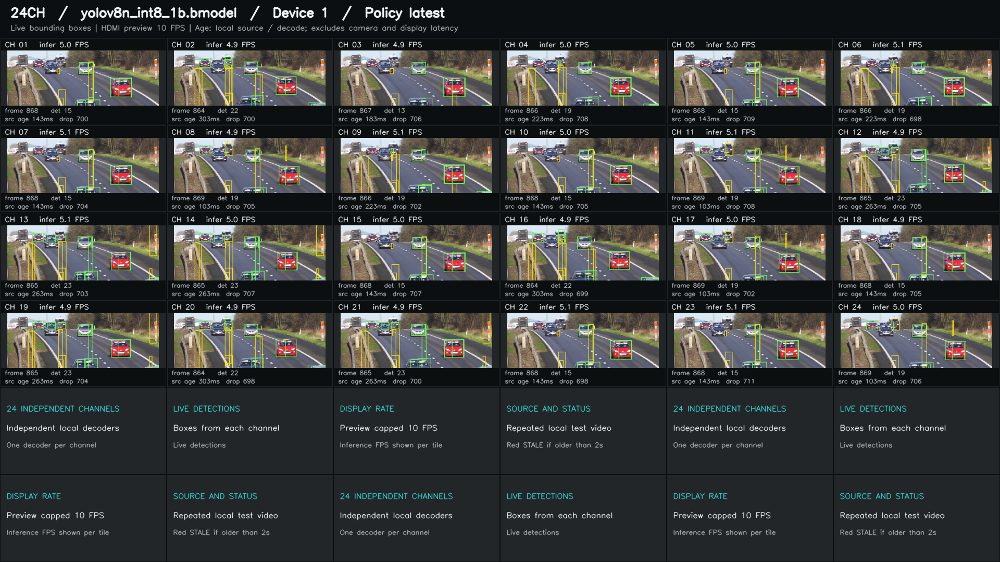

# HDMI 视频墙

各路独立解码并执行 YOLOv8 检测，将最近完成的画面、同帧检测框和状态信息组成视频墙，通过系统 ffplay 输出至 HDMI。默认使用 `latest` 策略：检测忙时持续读取输入，每路仅保留最新一张待检测帧，避免应用层排队持续积压。



这是历史实际运行截图：YOLOv8n INT8 batch 1，同一份本地视频由 32 个通道独立处理。各格 infer FPS 是当时的检测速率，顶部 HDMI preview 10 FPS 是显示更新上限。图用于说明布局和显示功能，不作为检测精度或并发达标依据；Device 1 只是当时的逻辑设备编号。

素材署名：Freestocks，[Cars On Highway - Free Stock Creative Commons Video](https://www.youtube.com/watch?v=-vLTFQv2_Vo)。截图所用视频经过重编码和循环延长，并叠加本程序的检测框；详见[截图素材](#截图素材)。

本目录包含 C++ 程序、检测器、拼屏模块、`build.sh`、`run.sh` / `run.py`。启动器负责成对管理检测程序和播放器。

需要多张卡同时运行、每张卡一个页面并通过按钮切换时，使用[多设备分页视频墙](docs/multi-device.md)：每卡支持 1–32 路，最多 4 张卡，未显示的设备也持续处理。

需要观察推理负载对解码的影响时，使用[解码观测与画面对照入口](docs/decoder-observation.md)：每卡默认 32 路持续运行，显示总解码 FPS、每路解码 / 推理 FPS、源进度落后和停顿状态，并选取 1–4 路对照解码图像与检测结果。可关闭推理运行同配置的解码基线。

长期展示使用[四小时多设备入口](docs/showcase.md)：自动读取实际 PCIe 链路，展示模式每卡 32 路；需要更高 TPU 利用率时推荐压测模式，Gen2 ×1 使用 20 路、Gen3 ×2 使用 32 路。两种模式均已完成[双卡并发 120 秒对照](docs/showcase.md#双卡展示与压测并发实测)：展示组 Gen2 ×1 TPU 平均 84.61%，压测组两卡分别为 97.59% / 100%。所有卡持续工作、可切页，默认正式四小时并保存汇总及利用率采样；四小时验收尚未完成。

双卡各 32 路的历史逐帧显示配置、抽帧后部分通道无结果的机制、不同设备的实测差异和延时取舍见 [32 路抽帧限制说明](docs/32-channel-realtime.md)。

设备 1 单卡 30 路、YOLOv8s 的 [300 秒优化实测与运行命令](docs/performance-30.md)使用 600 秒无损循环素材，测得总检测 **270.27 FPS**、每路 **8.92–9.06 FPS**、最差一路源帧年龄 P95 **201.50 ms**，TPU 采样平均 **97.25%**。正式首帧仍有最长 1.91 秒等待；长素材避开了本轮 EOF，但短片循环恢复问题尚未修复，详情和同输入 60 秒 A/B 均见报告。

这套 30 路配置作为 device 1（PCIe Gen3 ×2）后续每次满载测试的基准，使用统一的 [`benchmark.sh` 入口](docs/performance-30.md#每次使用统一基准入口)，默认自动准备长素材并运行 300 秒。报告附[实际 HDMI 画面](docs/performance-30.md#hdmi-实际画面)；[设备 1 的 32 路扩展](docs/performance-30.md#设备-1-单卡-32-路扩展测试)已确认全部通道能显示和检测，但启动阶段仍有秒级断档，不替换 30 路基准。

## 依赖与输入

完成[环境准备](../../docs/setup.md)，另需可访问的 Linux 图形桌面和系统 ffplay。构建使用 SOPHON SDK、CMake 与 C++11；启动器需要 Python 3.9+。

| 数据 | 位置与要求 |
|---|---|
| 输入视频 | 默认 `third_party/sophon-demo/sample/YOLOv8_plus_det/datasets/test_car_person_1080P.mp4`；自有文件或单路 `rtsp://` / `rtsps://` 地址用 `--input` 指定。 |
| YOLOv8 模型 | `--model s` / `--model n` 选择官方 INT8 batch 1 模型。 |
| 模型目录 | `third_party/sophon-demo/sample/YOLOv8_plus_det/models/BM1684X/`。 |
| 类别文件 | 同官方样例下的 `datasets/coco.names`。 |
| 可选辅助模型 | `data/models/score_gate/score_gate_reducemax_f32.bmodel`，仅在开启 score gate 时使用。 |

`scripts/prepare.sh` 准备默认 YOLOv8s 模型、类别及示例视频，数据由 [SOPHON 官方脚本](https://github.com/sophgo/sophon-demo/blob/release/sample/YOLOv8_plus_det/scripts/download.sh)获取。已有模型、仅缺视频时，可按[资源获取与缺失文件恢复](../../data/README.md#官方资源)单独补齐。YOLOv8n 需要另运行 `scripts/prepare_yolov8n.sh`。辅助模型必须与检测器的输出布局一致；未准备时保持 `--score-gate off`。

当前 Python 启动器只提供 s/n 官方模型预设，不接受自定义 `--bmodel` 或 `--classnames` 参数。

## 首次运行

完成 SDK 和图形桌面准备后，从仓库根目录执行。以下直接启动命令用于有权访问板子桌面的终端；通过 ADB 或 SSH 启动前，先按下方[连接与显示说明](#通过-adb-或-ssh-运行到-hdmi)选择显示地址和认证文件。首次使用官方视频即可，无需自行创建 `data/inputs/input.mp4`：

```bash
bash scripts/prepare.sh
bash demos/hdmi_wall/build.sh
bash demos/hdmi_wall/run.sh \
  --streams 1 --device 0 --model s --score-gate off --duration 20
```

`prepare.sh` 会安装基础工具并下载官方资源；已经准备好的环境和资源可跳过这一步。运行命令加 `--dry-run` 可以先查看计划，不启动检测或播放器。正常启动后显示带检测框的视频墙，控制台打印日志目录。

`--duration` 设置正式测量秒数；程序在各路就绪后另预热 3 秒，总耗时还包含初始化与收尾。省略时默认为 1800 秒。默认单路、device 0、YOLOv8s、score gate 关闭、`latest`、不限检测启动帧率、送检前最大帧年龄 250 ms；参数支持范围可查看：

```bash
bash demos/hdmi_wall/run.sh --help
bash demos/hdmi_wall/run.sh --list-streams
```

`--streams N` 或 `-n N` 选择 1–32 内的路数。使用本地文件时，启动器为每路独立读取同一个输入文件；程序支持范围不表示某个路数已达到指定处理速度。

播放器优先使用用户设置的 `DISPLAY`、`XAUTHORITY`、`PLAYER_LIB_PATH` 等环境变量。以有权限访问设备和当前桌面的用户运行；如环境需要提升权限，启动和停止应保持一致的身份。

## 通过 ADB 或 SSH 运行到 HDMI

电脑端的 `adb shell`、`ssh` 连接步骤见[进入设备](../../docs/setup.md#从电脑进入设备)。下面的命令均在进入设备后的 Linux 终端执行，示例仓库位于 `/userdata/1684X-EP-demo`，且已完成资源准备和编译。

连接方式和显示目标是两回事。启动器优先继承当前终端的 `DISPLAY`；SSH 的 `localhost:10.0`、`localhost:11.0` 等地址会把窗口送到电脑端的 X11 转发服务。板子本地 X11 桌面常为 `:0`，还必须配套使用该桌面的认证文件。仅修改 `DISPLAY` 不能解决认证不匹配。

先检查当前身份、显示设置和本地 Xorg：

```bash
id
printf 'DISPLAY=%s\nXAUTHORITY=%s\nSDL_VIDEODRIVER=%s\n' \
  "$DISPLAY" "$XAUTHORITY" "$SDL_VIDEODRIVER"
ls -l /tmp/.X11-unix/
ps -eo user,args | grep '[X]org'
```

### 板子停在 LightDM 登录界面

2026-09-09 重刷 rootfs 后，本板 Xorg 为 `:0`，启动参数包含 `-auth /var/run/lightdm/root/:0`，HDMI-1 为 1920×1080、60 Hz。此时 `/home/linaro/.Xauthority` 中的认证不能访问这个登录界面；播放器报 `No protocol specified` 和 `Could not initialize SDL - x11 not available`。以下命令适用于已确认相同显示地址、认证路径的系统。

**从 ADB 进入，且 `id` 显示当前为 root：**

```bash
cd /userdata/1684X-EP-demo
env DISPLAY=:0 \
  XAUTHORITY=/var/run/lightdm/root/:0 \
  SDL_VIDEODRIVER=x11 \
  PLAYER_LIB_PATH=/usr/lib/aarch64-linux-gnu \
  bash demos/hdmi_wall/run.sh \
  --streams 1 --device 1 --model s --score-gate off \
  --duration 60 \
  --policy latest --infer-fps 5 --max-frame-age-ms 250
```

**从 SSH 以 linaro 等普通用户进入：** 使用 `sudo env`，以有权读取上述 root 认证文件的身份启动，并显式传入显示设置。

```bash
cd /userdata/1684X-EP-demo
sudo env DISPLAY=:0 \
  XAUTHORITY=/var/run/lightdm/root/:0 \
  SDL_VIDEODRIVER=x11 \
  PLAYER_LIB_PATH=/usr/lib/aarch64-linux-gnu \
  bash demos/hdmi_wall/run.sh \
  --streams 1 --device 1 --model s --score-gate off \
  --duration 60 \
  --policy latest --infer-fps 5 --max-frame-age-ms 250
```

ADB 若以普通用户进入，同样使用第二条命令；SSH 若已是 root，使用第一条。`--device 1` 是本次实测设备，其他机器先用 `bm-smi --noloop` 确认编号。上面的环境变量仅作用于这次启动。提前停止时，ADB root 使用 `bash demos/hdmi_wall/run.sh --stop`，普通用户结束以 sudo 启动的运行时使用 `sudo bash demos/hdmi_wall/run.sh --stop`。

上述显示配置已通过 ADB root 复跑验证：正式运行 30 秒，单路 YOLOv8s、score gate 关闭，检测完成 5 FPS；从板子 `:0` 桌面采集的截图确认了视频和检测框，结束后检测程序和播放器均退出。记录位于板端 `data/results/hdmi-wall/20260909T035307Z-df79fc6f/`，属于本地输出，不随 Git 下载。

### 已登录用户桌面或使用其他显示管理器

在板子的图形桌面终端检查该会话实际使用的 `DISPLAY` 和 `XAUTHORITY`，使用有权访问此会话的用户启动。SSH 进入后需要使用本地桌面的值；SSH 的 `~/.Xauthority` 文件存在，并不说明它包含本地桌面的有效认证。其他显示管理器或 Wayland 会话需按实际图形环境配置，不能直接套用上述 LightDM 路径。

### 推理正常但 HDMI 没画面

控制台的 `HDMI wall is running` 是启动提示；检测达到 5 FPS 也不能单独证明 HDMI 已显示。先查看本次输出目录的 `player.log`，并核对 `run.json` 中的 `player_environment`：

| 现象 | 处理 |
|---|---|
| `DISPLAY` 为 `localhost:10.0` 等 SSH 转发地址 | 改用已确认的板子本地显示地址，并选择匹配的认证文件 |
| 已是 `:0`，但报 `No protocol specified` / SDL x11 初始化失败 | 检查实际桌面会话和认证文件的访问权限；当前 LightDM 登录界面可按上面的命令启动 |
| 显示器提示无信号 | 检查连接线、输入源及板端显示输出；有权限连接桌面后用 `xrandr --current` 检查 HDMI 是否 connected 且启用分辨率 |

## 自有视频与截图素材

自有视频放到 `data/inputs/` 后显式选择；本地视频需要可读取的帧率信息，程序按源帧率调度：

```bash
bash demos/hdmi_wall/run.sh \
  --input data/inputs/input.mp4 --streams 4 --device 0 --duration 60
```

单路相机输入可直接传入 URI，启动器保留原地址并跳过本地视频文件检查：

```bash
bash demos/hdmi_wall/run.sh \
  --input 'rtsp://camera.example/live' --streams 1 --policy latest --duration 60
```

RTSP 不额外按软件源帧率节流。多个不同相机使用 C++ 程序的 `--inputs-file` 入口，每行一个不同地址；Python 启动器暂不提供这个参数，也不支持把同一 RTSP 地址重复为多路。RTSP 断流重连尚未实现。

## 抽帧与实时处理

`latest` 将每路解码与检测分开执行。解码线程按输入节奏持续读帧，待检测槽容量为 1；新帧覆盖仍在等待的旧帧。检测线程空闲且达到限频间隔后，才取出当时最新的一帧。正在检测的帧会正常完成，检测框与画面始终对应同一帧。

| 参数 | 默认值 | 含义 |
|---|---|---|
| `--policy latest\|all` | `latest` | `latest` 优先处理新帧；`all` 保留原来的串行逐帧处理方式，便于对照。 |
| `--infer-fps` | `0` | 每路检测启动速率上限，支持非负有限小数；`0` 按实际处理能力运行，不设置上限。 |
| `--max-frame-age-ms` | `latest` 为 `250`，`all` 为 `0` | 送检前按本地帧的计划读取时刻或 RTSP 帧的解码完成时刻检查年龄，超龄则丢弃；`0` 关闭检查。支持非负有限小数。 |

`--policy all` 仅接受 `--infer-fps 0 --max-frame-age-ms 0`；省略这两个参数时自动使用 0。`--infer-fps 8` 表示每路至多约每 125 ms 启动一次检测，实际完成 FPS 仍取决于解码、模型、设备与输出开销。

### 上板实测的 HDMI 效果

2026-09-09 在 RK3588 + 单张 BM1684X（device 1，PCIe Gen3 ×2）上对比同一份 1080p25 公路视频，使用 YOLOv8n INT8 batch 1、score gate 开启、HDMI 预览开启，得到以下结果：

| 配置 | 正式时长 | 每路实际检测 FPS 范围 | 最差一路结果源帧年龄 P95 | 观察 |
|---|---:|---:|---:|---|
| 24 路逐帧 `all` | 60 秒 | 11.25–11.52 | 33.54 秒 | 画面在更新，但持续落后源视频，出现 STALE |
| 24 路 `latest`，检测上限 8 FPS | 120 秒 | 5.57–6.19 | 341 ms | 最终各路都有结果；首个 10 秒窗口有 1 路未出结果 |
| **24 路 `latest`，检测上限 5 FPS** | **60 秒** | **4.97–5.00** | **116 ms** | **源时间线持续推进，适合作为本次演示设置** |
| 16 路 `latest`，检测上限 8 FPS | 60 秒 | 7.98–8.00 | 96 ms | 需要更高检测频率时可选择较少路数 |

这里的 P95 取各路统计中的最大值，计时从本地帧计划读取到检测完成。24 路逐帧模式结束前最旧结果已落后约 **35 秒**，改为 latest / 5 后正式区间所有结果的最大源帧年龄为 **293 ms**。抽帧使画面能跟上当前源时间；HDMI 预览上限仍为 10 FPS，每路新画面的频率也受检测完成速率影响。这不是摄像头到显示器的端到端延迟测量。

<details>
<summary>查看 24 路 HDMI 实际画面对照</summary>

逐帧处理：画面持续更新，但源年龄已经增长到数十秒，各格标记为 STALE。



抽帧、每路检测上限 5 FPS：处理当前帧，显示主动丢帧数，保持源时间线推进。



两张截图来自各自运行中的一次采样，取样时刻不同；定量比较以上表的完整正式区间统计为准。画面素材出处和署名见[截图素材](#截图素材)。

</details>

**32 路尚未满足实时要求。** 本轮 latest / 8 测得解码约 746 FPS，低于 32×25 的 800 FPS 输入需求，19 路始终没有检测结果。抽帧发生在解码之后，不能消除这部分解码不足；不能把少量幸存结果的低年龄当作全部通道实时达标。完整配置、原始 run ID、短测限制和复现方法见[ADB 上板验证报告](docs/realtime-board-validation.md)。

### 推荐运行设置

以下使用本次已验证的 24 路 / 5 FPS 配置，需已准备 YOLOv8n、score gate 辅助模型和同名本地视频。未准备辅助模型时使用 `--score-gate off` 并重新测量，不能直接套用上表结果；YOLOv8n 可用 `bash scripts/prepare_yolov8n.sh` 准备。

```bash
bash demos/hdmi_wall/run.sh \
  --streams 24 --device 1 --model n --score-gate on --duration 60 \
  --input data/inputs/highway_1080p25_h264_8mbps_20min.mp4 \
  --policy latest --infer-fps 5 --max-frame-age-ms 250
```

需要每路约 8 FPS 时，先改为 `--streams 16 --infer-fps 8`。更换设备、素材、模型或输入规格后，查看逐路 `completed_fps`、`frame_age_ms`、`source_age_ms` 和丢帧统计再调整。解码后发布和取帧时都会检查年龄；检测完成时的年龄包含处理耗时，可以超过送检前的 250 ms 门槛。门槛过小或本地解码持续落后时，可能出现大量丢帧甚至没有检测结果。

停止当前运行后，用相同输入、模型、路数和时长执行逐帧对照：

```bash
bash demos/hdmi_wall/run.sh --stop
bash demos/hdmi_wall/run.sh \
  --streams 24 --device 1 --model n --score-gate on --duration 60 \
  --input data/inputs/highway_1080p25_h264_8mbps_20min.mp4 --policy all
```

抽帧发生在解码之后，不能减少源视频的解码负担。本地文件仍按源 FPS 读取；解码本身跟不上时，程序会丢弃超过年龄门槛的帧，关闭门槛后 `source_age_ms` 仍可能持续增长。RTSP 的相机、网络与解码器内部缓冲不在这个槽容量限制内，因此不能仅凭 `latest` 或帧年龄统计保证相机到 HDMI 的端到端延迟。

线程与设备帧所有权、独立调度测试及上板验收步骤见[实时调度实现与验证](docs/realtime.md)。

## 截图素材

页首画面使用 Freestocks 发布的 [Cars On Highway](https://www.youtube.com/watch?v=-vLTFQv2_Vo)。原视频获取入口及作者信息见原页面；通过作者允许的方式取得本地文件后，再传给 `--input`。素材声明为 Creative Commons，具体许可说明以原页面为准，保留作者署名和来源链接。

截图使用的本地版本为 1920×1080、25 FPS、H.264，重编码到约 8 Mbps，并将短片循环为 20 分钟。修改仅涉及编码和时长，没有增加拍摄场景。该衍生文件保留在本地，仓库只保存截图和来源说明。

首次运行使用上面的官方示例视频即可显示相同的视频墙布局；如需使用高速公路画面，准备原素材后替换输入。无需为了运行 Demo 额外生成 20 分钟文件，启动器会自动循环本地视频。

## 停止

```bash
bash demos/hdmi_wall/run.sh --stop
```

启动器按保存的进程身份结束对应程序和播放器，切换路数或模型前先停止当前运行。

## 首次运行排查

| 现象 | 检查位置与处理 |
|---|---|
| 提示 `Required file is missing` | 缺少 `hdmi_wall.pcie` 时重新构建；缺少 `/usr/bin/ffplay` 时准备系统播放器；视频、类别或模型缺失时按[获取说明](../../data/README.md#官方资源)补齐 |
| 检测已启动但 HDMI 没有画面 | 查看当前运行目录的 `player.log`、`run.json` 中的显示环境，按 [ADB / SSH 显示说明](#通过-adb-或-ssh-运行到-hdmi)区分 SSH 转发和本地桌面认证 |
| 提示已有 HDMI 运行或锁被占用 | 先用本页 `--stop` 结束对应运行，再重新启动 |
| 等待 FIFO 超时 | 查看 `worker.log`；若尚未创建运行目录，启动日志位置会打印到终端 |

## 输出

```text
data/results/hdmi-wall/
  latest.json
  launcher.lock
  <run-id>/
    run.json
    worker.log
    player.log
    config.json
    summary.json
    streams.csv
    preview.bgr
    wall.bmp
    status.json
    stream_<id>/
      detections.jsonl
      summary.json
```

| 文件 | 内容 |
|---|---|
| `run.json` | 启动参数、进程身份及启动/结束状态 |
| `worker.log` / `player.log` | 检测程序与播放器日志 |
| `config.json` | 模型、输入、设备与处理配置 |
| `summary.json` / `streams.csv` | 解码、检测完成、主动丢帧、帧年龄、窗口、处理阶段和异常统计 |
| `detections.jsonl` | 每个已处理帧的检测项，包含类别、置信度、原图像素坐标 xyxy、帧年龄及阶段耗时 |
| `preview.bgr` | 命名管道，传递原始拼屏画面，不是可独立播放的视频文件 |
| `wall.bmp` | 最近发布的整幅视频墙截图 |
| `status.json` | 各路最近帧号、检测数、推理 FPS、画面年龄和 stale 状态 |

`latest.json` 供停止入口定位对应运行；不要手动改成其他目录。截图和运行身份信息属于本地输出。

## 实际运行数据

最新抽帧效果见[上板实测的 HDMI 效果](#上板实测的-hdmi-效果)及 [2026-09-09 ADB 上板验证报告](docs/realtime-board-validation.md)。下表为此前逐帧模式的历史数据。

以下为 2026-09-08 在 RK3588 + 单张 BM1684X 上完成的历史运行：YOLOv8n INT8 batch 1，32 路独立读取本页所述高速公路 1080p25 H.264 视频，`device-bgr`，预热 3 秒，开启 HDMI 预览。

| 路数 | 测量时长 | 检测完成总 FPS | 最慢一路全程 FPS | 显示更新上限 | 状态 |
|---:|---:|---:|---:|---:|---|
| 32 | 1,800 秒 | 270.93 | 8.43 | 10 FPS | `measured`，`records_complete=true` |

该次运行开启了 **score gate 辅助模型**；当前首次运行命令使用 YOLOv8s 且关闭 score gate，配置不同，不能直接套用表中速度。辅助模型不随仓库发布，未准备时保持关闭。

这是旧版串行逐帧逻辑下持续 30 分钟的运行与记录数据，不表示 32 路逐帧 25 FPS，也不表示检测准确率已验收。预览的 10 FPS 与检测完成 FPS 分开计数。新目录、启动参数及 `latest` 策略已于 2026-09-09 上板验证，结果见本页的[抽帧实测对照](#上板实测的-hdmi-效果)。

## 指标与限制

画布为 1920×1080，显示更新上限为 10 FPS；它与每路检测 FPS 是不同指标。画面中的 infer FPS 是最近处理速率，最终报告使用正式记录窗口。屏上 `src age` 表示本地源计划到当前预览的年龄，RTSP 的 `dec age` 从解码完成计起，年龄超过 2 秒显示 `stale`。

完整检测计数在结果记录写入后推进，包含解码和显示准备相关工作；程序不输出完整编码视频，也未实现跟踪。`latest` 的 `frame` / `source_frame_id` 可以跳号，连续性应检查 `processed_index`；主动丢弃的帧不生成检测记录，也不算推理失败。

每路 summary 中，`dropped_overwrite` 是待检测旧帧被新帧覆盖的数量，`dropped_stale` 是送检前超龄丢弃的数量，`dropped_shutdown` 是收尾时放弃的待检测帧数量；`policy_drops` 为三者之和。`unprocessed_decoded_frames` 已扣除这些主动丢帧，正常收尾应为 0。`queue_high_watermark` 只统计等待槽，`latest` 最大为 1，不包含正在检测的帧。

检测记录中的 `frame_age_ms` 从解码完成计至 Detect 完成；`source_age_ms` 从本地帧计划读取时刻计至 Detect 完成，直播为 `null`。逐路 summary 提供同名年龄统计。`status.json` 的这两个年龄还包含预览准备和画面停留时间；原有 `age_seconds` 只表示最近预览更新后经过的时间，完整口径见[指标说明](../../docs/metrics.md#hdmi-视频墙的抽帧与年龄)。

预览显示的 `policy_drops` 是最近一次提交检测画面时的计数；没有新检测画面时它不会刷新，完整丢帧总数以结束后的 summary 为准。

多个通道重复读取同一视频不能代表独立相机输入；预览画面年龄也不是相机到屏幕的延迟。详见[指标说明](../../docs/metrics.md)。
