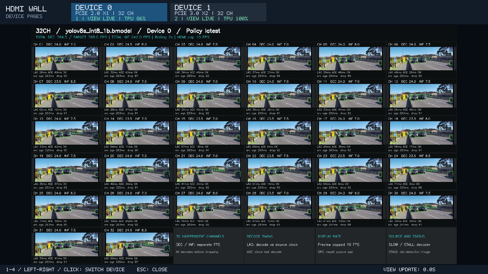

# HDMI 视频墙

在 RK3588 上调用 BM1684X，逐路解码、执行 YOLOv8 检测，并把图像和同帧检测框显示到 HDMI。每张卡支持配置 1–32 路，最多选择 4 张卡；多设备各有一个页面，切页时所有卡继续工作。已完成双实体卡验证，4 卡尚未上板验证。



当前普通墙保留全部视频格：顶部显示总解码 / 总检测 FPS，每格显示 DEC、INF、LAG、AGE 和状态；启用遥测时设备按钮显示 TPU。图中使用官方 1080p24 本地素材，32 路输入目标为 768 FPS。屏幕字段逐项解释见 [指标说明](docs/wall-indicators.md)。

## 选择运行入口

| 你的目的 | 入口 | 默认行为 | 操作文档 |
|---|---|---|---|
| 首次确认单卡推理和 HDMI 正常 | `run.sh` | device 0、1 路、1800 秒，系统 ffplay | [单设备运行](docs/single-device.md) |
| 自己指定多卡、路数和检测参数 | `multi_run.sh` | devices 0,1、每卡 32 路、1800 秒，按钮切页 | [多设备运行](docs/multi-device.md) |
| 每张卡展示完整 32 路 | `showcase.sh --mode showcase` | 自动识别设备、每卡 32 路、4 小时 | [展示与压测](docs/showcase.md) |
| 多卡并行，采用已测高 TPU 负载档位 | `showcase.sh --mode stress` | Gen2 ×1 为 20 路，Gen3 ×2 为 32 路、4 小时 | [展示与压测](docs/showcase.md) |
| 比较开启推理前后，解码是否降速或停顿 | `observe.sh` | 自动识别设备、每卡后台 32 路、300 秒，选 2 路放大对照 | [解码观测](docs/decoder-observation.md) |
| 复现 device 1 的历史 30 路基准 | `benchmark.sh` | device 1、30 路、300 秒 | [单卡基准](docs/performance-30.md#每次使用统一基准入口) |

时长均指正式测量，另有 3 秒预热、初始化和收尾。展示 / 压测默认四小时是配置，**四小时稳定性尚未验收**；`stress` 不保证每次 TPU 采样为 100%。设备链路由实际发现结果决定，不按 device 编号猜测。各入口的参数并不完全通用，见 [命令参数](docs/parameters.md)。

## 首次运行

先按 [环境准备](../../docs/setup.md)通过 ADB 或 SSH 进入设备，确认 SDK、构建工具和图形桌面。以下在板端仓库根目录执行，本板仓库位于 `/userdata/1684X-EP-demo`：

```bash
cd /userdata/1684X-EP-demo
bash scripts/prepare.sh
bash demos/hdmi_wall/build.sh
```

资源已经准备好可跳过 `prepare.sh`。默认视频、类别和 YOLOv8s 模型来自官方样例目录；Git 不包含 SDK、视频或模型。资源缺失时见 [下载与恢复](../../data/README.md#官方资源)。

先跑单卡 1 路、20 秒确认显示。下例适用于本板已经确认的 Xorg `:0`、LightDM 认证路径；ADB root 可去掉 `sudo`，其他桌面先按 [显示配置](docs/display.md)确认实际值：

```bash
sudo env DISPLAY=:0 \
  XAUTHORITY=/var/run/lightdm/root/:0 \
  SDL_VIDEODRIVER=x11 \
  PLAYER_LIB_PATH=/usr/lib/aarch64-linux-gnu \
  bash demos/hdmi_wall/run.sh \
  --device 0 --streams 1 --model s --score-gate off --duration 20
```

正常时 HDMI 显示视频和检测框，终端打印本次结果目录。单卡运行提前停止使用相同权限执行 `bash demos/hdmi_wall/run.sh --stop`。

## 双卡展示与压测

先完成单卡检查。`showcase.sh` 还要求已准备兼容的辅助模型 `data/models/score_gate/score_gate_reducemax_f32.bmodel`；该文件不随 Git 分发，`prepare.sh` 也不生成它。只有主模型时，先使用 [multi_run.sh 的 gate off 命令](docs/multi-device.md#双设备运行)。

下面先用 60 秒检查双卡完整 32 路页面；`auto` 会启动所有发现的设备，也可指定 `--devices 0,1`：

```bash
sudo env DISPLAY=:0 \
  XAUTHORITY=/var/run/lightdm/root/:0 \
  SDL_VIDEODRIVER=x11 \
  PLAYER_LIB_PATH=/usr/lib/aarch64-linux-gnu \
  bash demos/hdmi_wall/showcase.sh \
  --devices auto --mode showcase --duration 60
```

使用已测压测档位时，将 `--mode showcase` 改为 `--mode stress`。需要正式运行四小时，删除 `--duration 60` 或改为 `--duration 14400`；长素材准备、校验耗时及磁盘空间见 [长素材说明](docs/showcase.md#长素材与磁盘空间)。

点击设备按钮、按 `1`–`4` 或左右键切页。`Esc`、关闭窗口、启动终端 `Ctrl+C` 会结束整场多卡运行；也可在另一终端执行：

```bash
sudo bash demos/hdmi_wall/showcase.sh --stop
```

多卡的 showcase、stress、observe 和 benchmark 共用多设备运行管理；切换模式前先结束当前任务。单卡 `run.sh` 使用自己的停止入口。

## 文档导航

| 类别 | 文档 |
|---|---|
| 连接和排错 | [ADB / SSH 与 HDMI 显示](docs/display.md) |
| 操作与输出 | [单设备](docs/single-device.md) · [多设备](docs/multi-device.md) · [展示 / 压测](docs/showcase.md) · [解码对照](docs/decoder-observation.md) |
| 参数和读数 | [命令参数](docs/parameters.md) · [屏幕指标](docs/wall-indicators.md) · [JSON / CSV 统计口径](../../docs/metrics.md) |
| 抽帧 | [参数与历史画面对照](docs/realtime-usage.md) · [32 路超龄淘汰机制](docs/32-channel-realtime.md) |
| 实测 | [全部实测索引](docs/results.md) · [PCIe 对比](docs/pcie-comparison.md) |
| 开发 | [实时调度实现与测试](docs/realtime.md) |

## 指标与限制

输入 FPS、解码 DEC、检测 INF 和拼屏刷新率分别统计。`latest` 在完整解码后选择最新帧送检，因此减少检测帧数不等于减少解码负担。当前输出是一幅 1920×1080 视频墙、预览刷新上限 10 FPS，不是 32 路独立的 1080p 编码输出。

多个通道独立读取同一本地视频，不代表已验证同等数量的独立摄像头。源年龄不包含相机到屏幕的全部延时；TPU 满载、画面仍在动或总解码接近目标，也不能单独证明全部通道实时达标。逐路指标和对照方法见 [解码观测](docs/decoder-observation.md)。

## 实际运行数据

按 [实测索引](docs/results.md)查看当前功能验证、双卡档位对照及历史优化记录。报告保留原始输入、模型、时长、run ID 和限制；本地运行日志位于 `data/results/`，不随 Git 下载。

## 通过 ADB 或 SSH 运行到 HDMI

连接步骤和显示认证已集中到 [ADB / SSH 与 HDMI 显示](docs/display.md)，包含 LightDM 登录界面、已登录桌面和“推理运行但没有画面”的排查。

## 抽帧与实时处理

`latest / all`、检测限频和送检年龄的解释见 [抽帧设置](docs/realtime-usage.md#抽帧与实时处理)。当前 32 路展示使用 latest；早期失败条件及逐帧对照保留在历史报告中。

### 上板实测的 HDMI 效果

原公路 1080p25 的逐帧 / 抽帧截图和测量表已移至 [历史画面对照](docs/realtime-usage.md#上板实测的-hdmi-效果)，不与当前官方 1080p24 测试混用。

## 截图素材

当前首页截图来自 SOPHON 官方车辆 / 行人视频；历史公路截图来自 Freestocks。来源、署名和衍生文件说明见 [截图素材](docs/results.md#截图素材)。
