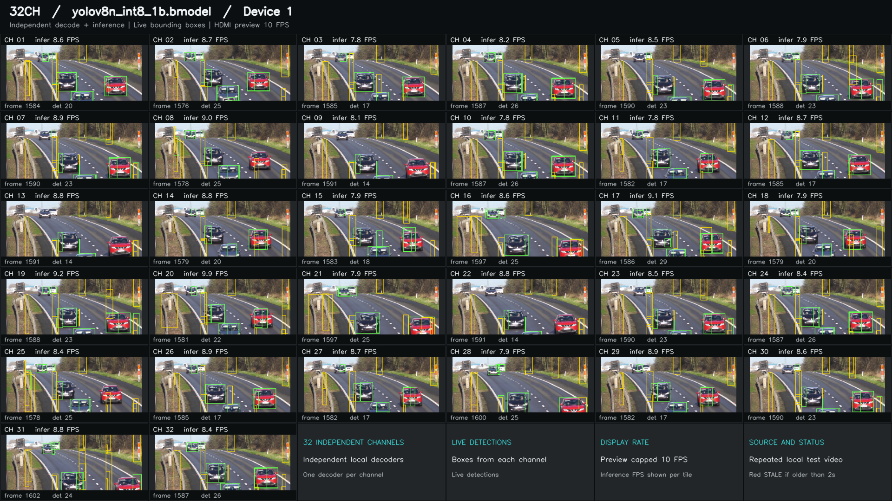

# 2026-09-08 单卡显示记录

历史 YOLOv8n 配置，不能替代当前 YOLOv8s 的结果。

## 历史 30 分钟显示验证

该阶段抽帧效果见[上板实测的 HDMI 效果](realtime-usage.md#上板实测的-hdmi-效果)及 [2026-09-09 ADB 上板验证报告](realtime-board-validation.md)。下表为此前逐帧模式的历史数据。

以下为 2026-09-08 在 RK3588 + 单张 BM1684X 上完成的历史运行：YOLOv8n INT8 batch 1，32 路独立读取下文所述高速公路 1080p25 H.264 视频，`device-bgr`，预热 3 秒，开启 HDMI 预览。

| 路数 | 测量时长 | 检测完成总 FPS | 最慢一路全程 FPS | 显示更新上限 | 状态 |
|---:|---:|---:|---:|---:|---|
| 32 | 1,800 秒 | 270.93 | 8.43 | 10 FPS | `measured`，`records_complete=true` |

该次运行开启了 **score gate 辅助模型**；单卡首次运行命令使用 YOLOv8s 且关闭 score gate，配置不同，不能直接套用表中速度。辅助模型不随仓库发布，未准备时保持关闭。

这是旧版串行逐帧逻辑下持续 30 分钟的运行与记录数据，不表示 32 路逐帧 25 FPS，也不表示检测准确率已验收。预览的 10 FPS 与检测完成 FPS 分开计数。新目录、启动参数及 `latest` 策略已于 2026-09-09 上板验证，结果见[抽帧实测对照](realtime-usage.md#上板实测的-hdmi-效果)。

本图为历史布局，当前屏幕字段见 [指标说明](../wall-indicators.md)。
