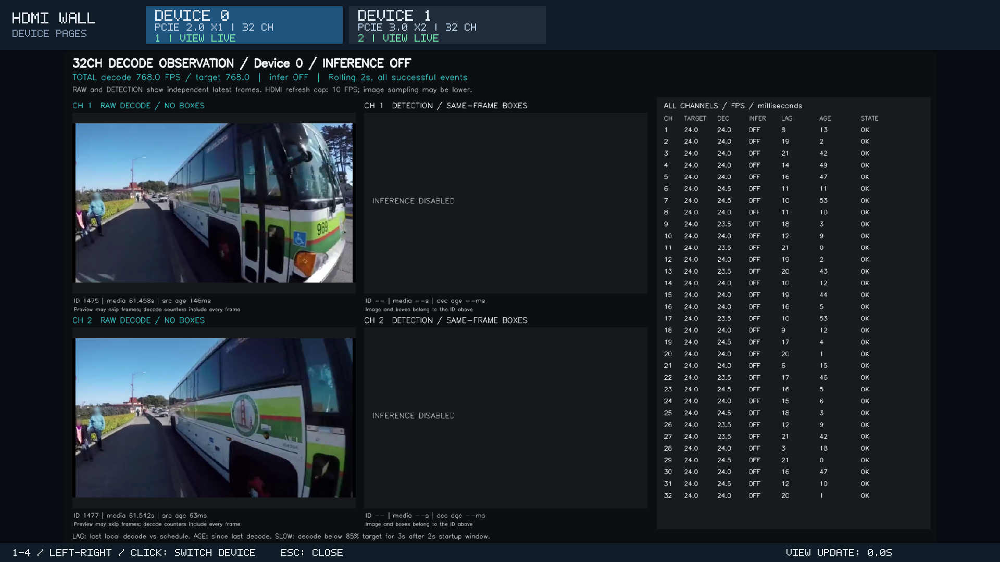
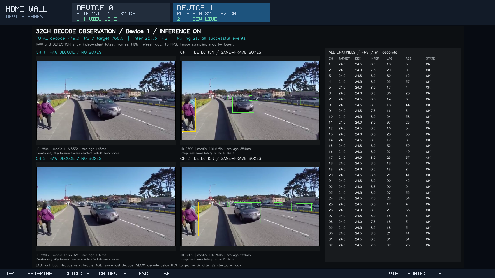

# 对比解码输出与推理结果

[仓库首页](../../../README.md) / [HDMI 文档导航](../README.md#文档导航) / [实测索引](results.md)

`observe.sh` 用同一份本地长素材，分别运行“关闭推理的解码基线”和“开启推理的负载组”，观察推理负载是否影响解码速度、源进度和连续性。默认每卡 **32 个后台解码通道**、正式运行 **300 秒**、3 秒预热，选取通道 **0、1** 显示解码图像与推理结果对照。通道编号从 0 开始；可以选 1–4 路，通常使用 2 路或 4 路。

选中少量对照画面不会把后台 32 路减成 2 路：两组都保留全部配置通道的解码，负载组还保留全部通道的推理。所有选中设备同时运行，切换设备页面不会停止其他设备。

需要同时看到 32 路图像时，直接使用 `showcase.sh --mode showcase` 或 `multi_run.sh`：普通视频墙已默认显示总解码 / 总推理 FPS，以及每格的解码 FPS、推理 FPS、LAG、AGE 和解码状态。`observe.sh` 保留为少量画面的放大对照与正式解码耗时统计入口。两种布局都使用独立的成功解码 / 推理事件计数；多设备播放器启用遥测后，还在设备按钮显示 TPU 利用率。

“解码图像”指已经经过解码器输出的图像，不是尚未解码的视频码流。解码图像和推理结果分别展示各自最近完成的帧，帧号、源时间可能不同；应结合这些标识判断落后情况，不能把两个不同帧的画面差异当成检测错误。

## 需求与验证边界

目标是量化“真实模型推理使 TPU 达到高负载时，解码速度、连续性和延时受到多少影响”。总解码 FPS、每路解码 FPS 必须来自成功解码事件，不能从检测 FPS、预览刷新率或输入标称帧率推算；推理与预览仍可抽帧。页面需要能识别解码降速和长时间无新帧，不能以画面仍在运动作为解码正常的依据。

解码基线与推理组应使用相同输入、路数及观察参数，并记录正式窗口内 TPU 利用率，确认推理组是否实际达到所要求的负载。当前双卡 32 路实测仅 Gen3 ×2 接近 TPU 满载；Gen2 ×1 不能以“命令要求满载”替代其实际约 79% 的结果。

左右两幅画面都依赖同一解码器输出，因而可能一起落后。它们可以展示解码完成到检测结果之间的差异，但不能单靠画面位置判断解码自身延时。本地文件使用独立的计划播放时钟计算 LAG，并用 AGE 显示距离最近一次解码的时间。若要直观看到真实输入到显示的整体延时，需要带可对齐源时间戳的输入或独立参考播放；当前未实现独立参考播放器，也未测量摄像头端到端延时。

如果问题进一步要求“最大解码能力下降了百分之多少”，还需分别测量无推理和 TPU 满载时的解码吞吐上限，确保输入供给足够，不能只比较受 32 × 24 FPS 供给限制的两组结果。当前入口验证既定输入负载下的表现，不冒充最大解码容量测试。

## 手动运行两组

先完成 [SDK 与资源准备](../../../docs/setup.md)，并重新构建包含观察功能的程序：

```bash
cd /userdata/1684X-EP-demo
bash demos/hdmi_wall/build.sh
```

若已有 HDMI 任务运行，先结束该任务。观察入口与多卡展示共用同一个 supervisor 和锁，不会自动停止已有任务。以 sudo 启动的多卡任务可这样停止：

```bash
sudo bash demos/hdmi_wall/observe.sh --stop
```

下面的显示认证适用于本板已确认的 Xorg `:0` / LightDM 环境；其他环境按 [ADB / SSH 显示说明](display.md)使用正确的认证路径。入口保留调用者传入的显示环境。ADB root 可去掉 `sudo`。

第一组关闭推理，作为解码基线：

```bash
sudo env DISPLAY=:0 \
  XAUTHORITY=/var/run/lightdm/root/:0 \
  SDL_VIDEODRIVER=x11 \
  PLAYER_LIB_PATH=/usr/lib/aarch64-linux-gnu \
  bash demos/hdmi_wall/observe.sh \
  --devices auto --streams 32 --duration 300 \
  --inference off --compare-streams 0,1 --observe-preview-fps 5
```

等待运行结束，保留打印出的结果目录，再运行第二组：

```bash
sudo env DISPLAY=:0 \
  XAUTHORITY=/var/run/lightdm/root/:0 \
  SDL_VIDEODRIVER=x11 \
  PLAYER_LIB_PATH=/usr/lib/aarch64-linux-gnu \
  bash demos/hdmi_wall/observe.sh \
  --devices auto --streams 32 --duration 300 \
  --inference on --compare-streams 0,1 --observe-preview-fps 5
```

两条命令只改变 `--inference`。内部同时关闭或开启相应的 score gate：

| 设置 | 解码基线 `off` | 推理负载组 `on` |
|---|---|---|
| 每卡后台解码通道 | 32 | 32 |
| 模型推理实例 | 不创建 | YOLOv8s INT8 batch 1 |
| Score gate / 额外读取预算 | off / 0 KiB | on；实际 Gen2 ×1 为 128 KiB，Gen3 ×2 为 64 KiB |
| 输入素材、运行时长、预热 | 相同 | 相同 |
| 调度 / 推理限频 / 送检年龄配置 | latest / 0 / 250 ms；没有推理任务 | latest / 0 / 250 ms |
| 本地首帧预取 / 记录模式 | prime on / summary | prime on / summary |
| 选中解码图像的采样上限 | 每路 5 FPS | 每路 5 FPS |

关闭推理时，启动器不要求主模型、类别文件或 score-gate 模型存在，也不向 worker 传入这些模型参数；仍需要 SDK 和解码依赖。基线的检测完成 FPS 为 0、模型实例数为 0，这是预期行为；应查看解码统计，而不是把检测 FPS 为 0 当作解码失败。

`--devices auto` 使用真实 sysfs 设备映射和 PCIe 链路；也可指定 `--devices 1` 或 `--devices 0,1`。未知或尚无对应实测档位的链路，在推理组使用 64 KiB 预算并标明未认证，不按设备编号猜测链路。TPU 使用率以本次采样为准，不保证每次满载。

## 调整观察范围

在两组中保持相同的设备、通道数、时长、选中通道和预览频率。例如选择 4 路对照，使用 `--compare-streams 0,1,16,31`；后台仍是每卡 32 路。调整为每卡 20 路时使用 `--streams 20`，选中的编号必须小于 20。

`--observe-preview-fps` 的范围为大于 0 且不超过 10，默认 5。它限制选中画面的图像采样，不限制全部解码完成事件的计数，也不把后台推理变成 5 FPS。只运行 1 路时，应显式使用 `--streams 1 --compare-streams 0`。

在启动命令最后加入 `--dry-run`，可以先检查实际设备、素材路径、各卡预算及 worker 参数；不会生成素材或启动进程。Windows 上需要显式提供 Linux `--root` 和 `--devices`，PCIe 信息显示未知，不读取或伪造板端链路。

按 `Esc`、关闭显示窗口或在启动终端按 `Ctrl+C` 可提前结束；另一个终端也可运行 `sudo bash demos/hdmi_wall/observe.sh --stop`。提前结束的结果不等同于完成 300 秒测量。

## 结果和统计范围

默认 300 秒运行自动准备并复用 `data/inputs/hdmi_wall_demo_loop_600s.mp4`。两组使用相同视频文件，通过 stream copy 重复官方片段，不重编码；长素材避开测量期间的短片 EOF 重开问题。增加 `--duration` 时，入口按“正式时长 + 3 秒预热 + 60 秒余量”向上取整到 600 秒准备素材。

当前官方素材实际为 **1920 × 1080、24 FPS**，每卡 32 路的目标总解码速率是 **768 FPS**。800 FPS 对应每路实际输入 25 FPS；不能把 24 FPS 素材的标签改成 25 就作为同等输入验收。页面的短窗口计数可能在 768 附近轻微波动，正式平均以结束后的 summary 为准。

观察配置保存在 `data/results/hdmi-observe/<配置 ID>/device-config.json`，实际运行结果继续使用：

```text
data/results/hdmi-wall-multi/<运行 ID>/
  run.json
  viewer.json
  viewer-status.json
  telemetry.jsonl
  telemetry-summary.json
  device_0/
    config.json
    summary.json
    status.json
    wall.bmp
    worker.log
  device_1/...
```

`latest.json` 会指向最新一组，第二次运行后它不再指向第一组。对照时应分别保存两次启动打印的运行目录。`run.json.device_configuration_context` 记录本次是解码基线还是推理负载组，以及实际 PCIe、通道数配置来源和观察参数。

正式测量关注以下 `summary.json` 字段：

| 字段 | 含义 |
|---|---|
| `total_decoded_fps` / `minimum_stream_decoded_fps` | 全卡解码 FPS 与最低单路解码 FPS |
| `streams[].decoded_fps` / `source_fps` | 每路实际解码 FPS 与本地输入帧率 |
| `streams[].decode_observation.frames` | 正式窗口内全部成功解码完成帧数，统计发生在 latest 覆盖、送检超龄等策略过滤之前 |
| `streams[].decode_observation.read_ms` | 同一成功解码集合的读取耗时统计，包含 SDK 调用中的等待 |
| `streams[].decode_observation.source_lag_ms` | 本地成功解码相对其应播放时间的落后量；RTSP 为未知 / null |
| `streams[].decode_observation.completion_continuity` | 解码完成的首次等待、相邻完成间隔及包含首尾边界的最长空窗 |

解码观察的 `population` 为 `successful_decode_completions_before_policy_filter`。既有 `decode_ms` 仍属于最终进入推理并完成记录的帧集合，不代表所有解码帧，不能替代新增的 `decode_observation.read_ms`。基线消费的解码帧独立记为 `baseline_consumed`，不会伪装为检测完成帧或全部算作丢帧。

页面上的短期滚动 FPS 和运行结束后的正式窗口平均 FPS 使用不同时间范围，应分别解读。预取首帧保留其真实解码时间；发生在正式窗口外的解码事件不会凭空加入正式 FPS。

观察期间，各卡 `status.json` 每秒更新一次，新增的 `observation` 对象独立于原检测画面的状态：

| 状态字段 | 用途 |
|---|---|
| `observation.total_decode_fps` / `total_infer_fps` | 全卡近期解码 / 推理 FPS；基线推理 FPS 为 0 |
| `observation.streams[]` | 全部后台通道的解码、推理累计数，当前帧号、源时间、最近事件年龄和速率 |
| `observation.streams[].source_lag_ms` / `read_ms` | 最近一次成功解码的本地源落后 / 读取耗时，不是正式窗口的均值或 P95 |
| `observation.streams[].state` / `sustained_slow` / `stalled` | 近期状态与持续降速、长时间无解码的提示；没有推理图像时仍更新 |
| `observation.comparisons[]` | 选中通道的 `decoded` 和 `detected` 图像各自帧号、源时间、年龄及是否已有图像 |

滚动速率使用最近 20 个完整的 100 ms 桶，窗口为 2 秒，统计截止点最多落后当前时刻 100 ms；排除尚未填满的当前桶，避免持续低估稳定输入。初始累计解码数可包含实际发生在播放时钟开始之前的预取首帧，而滚动事件计数不把该事件改写成新的时间。对于目标帧率已知的本地源，持续低于目标 85% 达 3 秒会提示降速；这不是独立的直播验收标准。RTSP 目标帧率未知时显示 N/A，不据此猜测“满帧”。

对照面板左侧为 `RAW DECODE / NO BOXES`，右侧为 `DETECTION / SAME-FRAME BOXES`。右侧检测框与右侧图像来自同一帧；左右两幅图是各自的最新结果，不保证对应同一帧。基线中推理侧标明关闭，应查看左侧解码画面和独立的全通道解码指标。

`telemetry-summary.json.formal_measurement.devices` 已按各卡正式窗口筛选 TPU 采样；顶层 `devices` 包含启动等全程采样。读取失败记为 null 和失败次数，不作 0% 使用率。还需检查 worker 的 `status`、`accounting_complete`、实际测量时长和错误信息，不能仅凭 TPU 均值判断本次完成或达标。

## 观察功能本身的开销

选中通道会额外生成异步的解码图像预览，最高为设定采样率的 640 × 360 图像；推理组的选中结果预览也使用 640 × 360 和相同采样上限。未选中的后台通道继续保留原推理预览路径。图像转换、回读、CPU 拼图和页面显示都会占用资源，且两侧完成的帧不必相同。

因此，本次统计包含观察功能带来的开销，不能直接套用此前未开启观察的 [showcase 性能表](showcase.md#双卡展示与压测并发实测)。应先比较相同观察参数下的解码基线与推理组，再判断推理负载是否同时降低解码 FPS、增加源落后或扩大解码空窗。仅凭阶段 API 墙钟耗时增长，不能直接断定是 PCIe、VPP 或某一硬件单元耗尽。

本地源落后基于本机的文件播放时钟，不是摄像头到 HDMI 的端到端延时。RTSP 没有对应的已知本地源时基，输入链路中的缓存、丢包和摄像头延时仍未知。这个本地重复素材实验不等于 32 个独立摄像头的直播验收。

本地输入按素材帧率供给。如果两组都达到目标 FPS，只能说明这一路数和输入负载下未观察到解码吞吐下降，不能据此推算解码器的最大吞吐或剩余性能。测量解码上限需要另做不受输入供给速度限制的容量实验。

TPU 采集优先使用 PATH 中的 `bm-smi`，否则使用本板 SDK 的 `/opt/sophon/libsophon-current/bin/bm-smi`，适配 sudo 默认 PATH；启动后应确认 `telemetry.jsonl` 中 `error` 为空且 `tpu_util_percent` 有数值。

## 2026-09-10 双卡各 32 路验证

两卡同时运行，先关闭推理，再开启推理；每组正式 120 秒、预热 3 秒，输入均为同一份 600 秒 1080p24 素材。对照通道为 0、1，解码与检测图像各限 5 FPS。显示页面切换后另一张卡仍继续接收和处理全部 32 路。

| 模式 | 设备 / 链路 | 总解码 FPS | 最低单路解码 FPS | 总检测完成 FPS | TPU 正式采样均值 |
|---|---|---:|---:|---:|---:|
| 解码基线 | 0 / Gen2 ×1 | 768.00 | 24.000 | 0 | 0%（23 次） |
| 解码基线 | 1 / Gen3 ×2 | 768.00 | 24.000 | 0 | 0%（24 次） |
| 推理开启 | 0 / Gen2 ×1 | 768.01 | 23.992 | 216.97 | 79.42%（24 次） |
| 推理开启 | 1 / Gen3 ×2 | 768.02 | 24.000 | 267.12 | 98.25%（24 次） |

| 模式 / 设备 | 全部成功解码读取均值 | 本地解码落后均值 | 最差一路解码落后 P95 | 最长解码完成空窗（含窗口首尾） |
|---|---:|---:|---:|---:|
| 基线 / 0 | 19.30 ms | 21.19 ms | 37.89 ms | 130.19 ms |
| 基线 / 1 | 15.23 ms | 16.94 ms | 36.48 ms | 103.42 ms |
| 推理 / 0 | 39.07 ms | 56.06 ms | 106.58 ms | 134.46 ms |
| 推理 / 1 | 24.30 ms | 26.34 ms | 56.59 ms | 131.77 ms |

这些结果说明：本轮推理负载没有使正式平均解码吞吐明显低于 32 × 24 FPS，但解码读取耗时及相对播放时钟的落后增加，Gen2 ×1 更明显。Gen3 ×2 在 TPU 接近满载时仍达到本次输入目标；Gen2 ×1 的 32 路并未满载，不能把该组写成“两张卡都满载”。本表衡量包含预处理、推理、回读和预览的联合负载影响，不能单独归因为 TPU 或 PCIe。上述毫秒数是解码侧统计，不是 HDMI 端到端延时。

全部 4 个 worker 均为 `status=measured`、`accounting_complete=true`，全部通道都有成功解码，推理组全部通道均有检测完成；正式 TPU 采样无读取失败。基线模型实例数为 0，推理组每卡为 32。板端 C++ 测试 4/4、Python 测试 134/134 通过，其中包含恒定 24 FPS 输入的分桶偏差、停止后的 FPS 衰减，以及 sudo PATH 下的 TPU 采集验证。本轮属于短时功能与对照验证，不代表四小时稳定性验收或已修复此前内核故障。

另用 `--compare-streams 0,1,16,31` 完成双卡各 32 路、60 秒的四组画面对照验证，全部对照图像和后台计数可用，两个 worker 均正常完成。关闭观测的原有布局也完成双卡各 2 路出图回归，并在预热期间通过 `observe.sh --stop` 停止；该停止测试明确标记为 interrupted，不计作性能测试。收尾检查没有遗留 demo 进程，两卡恢复空闲，当前启动的内核日志未出现新的 Oops、FIFO -1、API timeout 或 soft lockup。

- 基线目录：`data/results/hdmi-wall-multi/20260910T013741Z-c6228b81`
- 推理目录：`data/results/hdmi-wall-multi/20260910T014001Z-005634c5`
- 板端汇总及证据：`data/results/observation-validation-20260910/comparison.json`、`validation-evidence.tar.gz`
- 实测程序 SHA-256：`005d551d81af9f472bf5a74c9fbb6c91149dff87d8846f0770ba014f497d2604`

下图是实际 HDMI 截图，均保持每卡 32 路后台工作。基线左侧显示已解码图像、右侧标明推理关闭；推理组右侧的框与其自身图像属于同一帧，左右图像不保证帧号相同。画面中的短期 FPS 可因解码完成抖动或追赶而暂时超过 / 低于目标，正式平均见上表。




