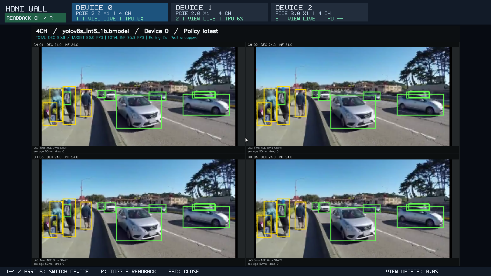
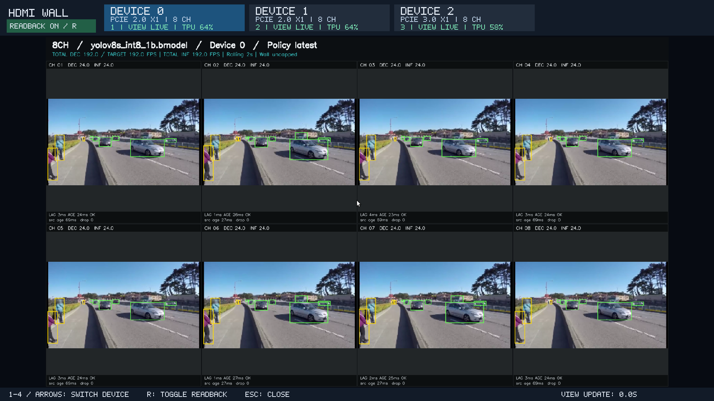
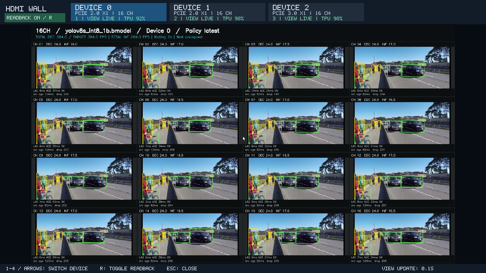
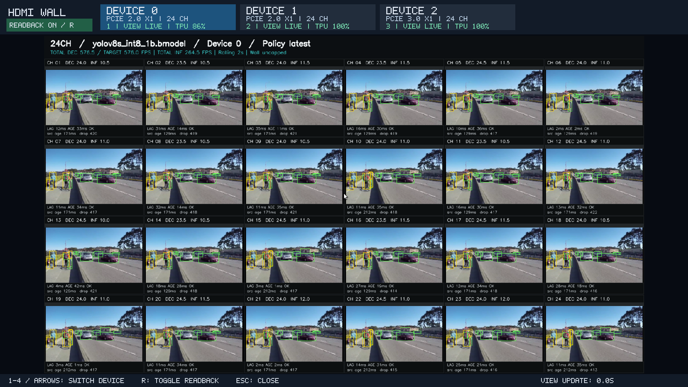
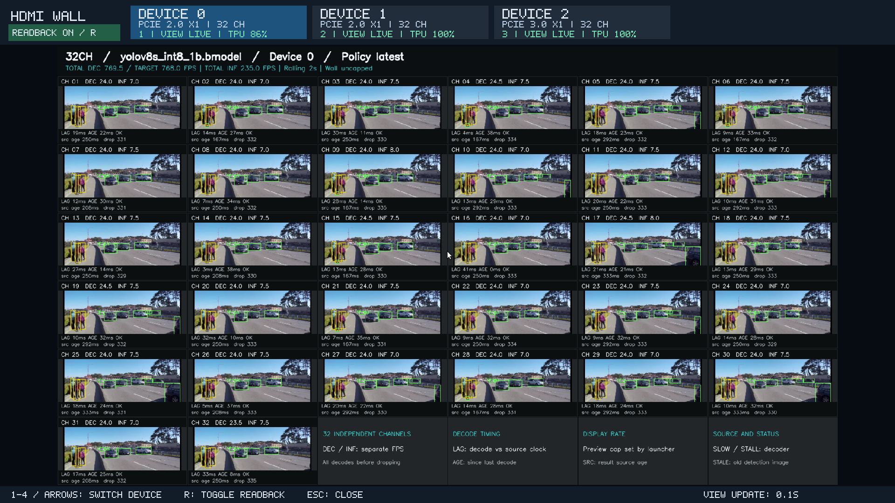

# 视频墙路数、布局与流畅度

[HDMI 入口](../README.md) · [参数说明](parameters.md) · [数据摘要](data/layouts-20260929.json)

卡数和每卡路数独立配置：选择 1–4 张卡，每张卡显示自己的视频墙，切页时其他卡继续工作。以下五档指**每卡** 4 / 8 / 16 / 24 / 32 路，程序按实际路数自动布局。

## 运行方式

在已配置 SDK、模型、素材与 HDMI 显示环境的板端仓库根目录执行，一次只运行一档：

```bash
bash demos/hdmi_wall/showcase.sh --devices auto --streams 4 --duration 300 \
  --preview-fps -1 --display-fps 30 --wall-fps 0
```

将 `--streams 4` 换成 `8`、`16`、`24` 或 `32`。`--devices auto` 选择当前 1–4 张卡；也可指定 `--devices 0` 等设备列表。结束运行使用 `bash demos/hdmi_wall/showcase.sh --stop`。

`--preview-fps -1` 取消单路预览限频；播放器 30 FPS 只是显示刷新设置，不能让同一张图变成新视频帧。原 showcase 默认的预览 3 FPS 适合吞吐对照，不适合追求流畅画面；要复现旧性能记录，仍显式使用其原参数。

## 五档实测

2026-09-29，三卡同时运行：卡 0 / 1 为 PCIe2 ×1，卡 2 为 PCIe3 ×1。每档每卡正式 45 秒，官方 1080p24 同一本地视频独立读取，YOLOv8s INT8，线性输出＋8 块额外缓冲、latest、结果回传开启。每卡每路都有结果、计数完整、无工作线程错误；完整计数、年龄淘汰、正式 TPU 和最长无结果间隔见数据摘要。

| 每卡路数 | 列×行 | 平均每路预览提交 FPS：卡 0 / 1 / 2 |
|---|---|---|
| 4 | 2×2 | 24.00 / 24.00 / 24.00 |
| 8 | 4×2 | 24.00 / 24.00 / 24.00 |
| 16 | 4×4 | 17.39 / 17.93 / 18.45 |
| 24 | 6×4 | 11.09 / 11.88 / 11.97 |
| 32 | 6×6 | 7.46 / 8.31 / 8.66 |

这里以正式窗口内提交的预览张数除以时长和路数，不是屏幕扫描帧率，也不保证每次提交都显示在屏幕上。短测不足以判断长期稳定性；这些是三卡并发结果，不能直接推广到四卡。

4 / 8 路接近源视频 24 FPS；更多路数时，检测吞吐分摊到每一路，画面更新随之下降。当前预览与检测结果来自同一帧，不能仅靠提高播放器刷新率让 32 路全部达到 24 FPS。本轮将 32 路定位为多路检测展示档位，不承诺每路 24 FPS，也未实现独立于检测更新的视频播放路径。

## 实际画面

下图是板端 X11/HDMI 桌面的真实截图，当前页为卡 0，顶部保留另外两张卡的状态。截图上的瞬时 TPU 和滚动 FPS 不替代正式窗口汇总；4 路截图摄于启动早期，出现 START 和低 TPU 样本。各路输入使用同一素材，画面相似是预期结果。

预览回传的是 256×144 小图，低路数放大显示会比较模糊；本次调整布局和刷新，没有提高预览图像分辨率。

### 每卡 4 路



### 每卡 8 路



### 每卡 16 路



### 每卡 24 路



### 每卡 32 路



32 路使用 6×6 网格，最后四格显示指标说明。8 路使用 4×2，保留原始图像比例，格内会有留白。

## 复核记录

板端构建通过；7 项 CTest 通过，149 项 Python 测试中 148 项通过、1 项平台测试跳过。五档在三张实际设备上完成采集，并检查了布局、各路图像与状态。原始数据保存在本地和板端 `data/results/layouts-smooth-20260929/`，每档目录包含截图、各卡状态、summary 与遥测；源码改动后的本轮数据与之前预览 3 FPS 的记录分开保存。
