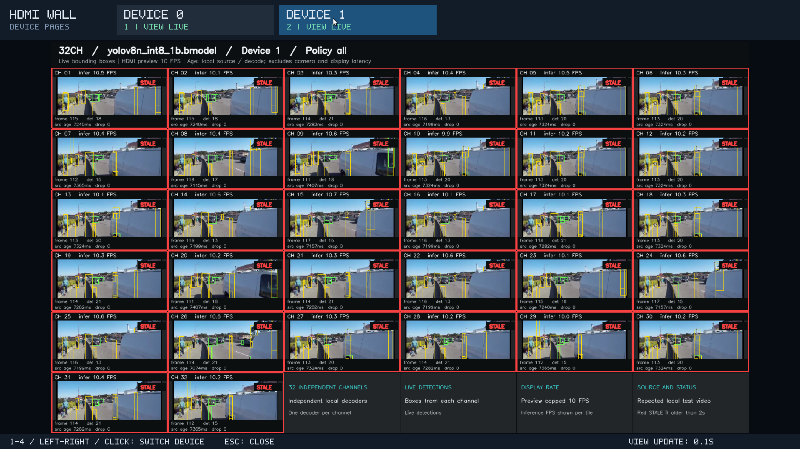

# 多设备分页视频墙

[仓库首页](../../../README.md) / [HDMI 文档导航](../README.md#文档导航) / [实测索引](results.md)

每张 BM1684X 对应一个页面，每卡支持 1–32 路，最多同时选择 4 张卡。2 张卡各 32 路是总计 64 路；4 张卡各 32 路是总计 128 路。顶部按实际配置生成设备按钮，点击切换当前页；所有选中的设备都在后台持续解码、推理和更新画面。

这是可自由设置路数、模型和抽帧参数的基础多卡入口。普通视频墙已显示每路 DEC / INF、LAG / AGE 和状态；需要顶部 TPU 数值时加 `--telemetry-interval 5`。字段含义见 [屏幕指标](wall-indicators.md)。

需要自动按 PCIe 链路选择配置、准备长素材时，使用 [showcase / stress](showcase.md)。需要关闭 / 开启推理作解码对照，使用 [observe](decoder-observation.md)。历史单卡、多卡测试集中在 [实测索引](results.md)，不能直接相加单卡速度推断双卡性能。

启用推理时，左上角 READBACK 按钮或 R 键控制所有卡的模型结果与像素预览回传；OFF 保留实际解码 / 推理但隐藏视频墙。按钮含义、低回传 profile 和最新数据见 [回传开关](readback-toggle.md)。纯解码 `--inference off` 模式不提供该按钮。

## 准备

按[环境说明](../../../docs/setup.md)准备 SDK、编译工具和官方资源，执行 `bash demos/hdmi_wall/build.sh` 构建每卡使用的检测程序。多设备入口为 `multi_run.sh` / `multi_run.py`，统一显示程序为 `viewer.py`，需要 Python 3.9+、系统 SDL2 运行库和可访问的本地 X11 桌面；本次板上系统 ffplay 已依赖并安装 `libSDL2-2.0.so.0`。

先用 `bm-smi --noloop` 确认设备编号，再指定 `--devices`，不要根据 PCIe 插槽位置猜测编号。通过 ADB 或 SSH 进入设备的操作，以及 DISPLAY、LightDM 认证的适用条件见[连接与显示说明](display.md)。

如果原单设备入口还在运行，先以相同权限执行 `bash demos/hdmi_wall/run.sh --stop`；以 sudo 启动的任务用 `sudo bash demos/hdmi_wall/run.sh --stop`。单设备和多设备入口共用显示任务锁，避免两套程序同时抢占设备和 HDMI。

## 双设备运行

先用每卡 1 路确认两个页面都能出画面。下例在板端 `/userdata/1684X-EP-demo` 执行，适用于已确认 Xorg 使用 `:0` 和 `/var/run/lightdm/root/:0` 的 LightDM 系统；SSH 普通用户使用 `sudo env`，ADB root 可去掉 `sudo`。

```bash
cd /userdata/1684X-EP-demo
sudo env DISPLAY=:0 \
  XAUTHORITY=/var/run/lightdm/root/:0 \
  SDL_VIDEODRIVER=x11 \
  PLAYER_LIB_PATH=/usr/lib/aarch64-linux-gnu \
  bash demos/hdmi_wall/multi_run.sh \
  --devices 0,1 --streams 1 --model s --score-gate off \
  --duration 60 --policy latest --infer-fps 5 --max-frame-age-ms 250 \
  --telemetry-interval 5
```

未提供 `--device-config` 时，全部设备使用同一个 `--streams` 参数；需要逐卡路数、回传预算、preview_fps 和 output_buffer 时，使用[每卡配置](showcase.md#每卡独立配置)。页面只按 `--devices` 中的设备生成。仅使用设备 1 时可传 `--devices 1`，不会生成不存在的设备 0 页面。

### 每卡 32 路：优先完整显示的逐帧配置

**本节为历史逐帧对照，不是当前默认展示方案。** 当前双卡各 32 路使用 [showcase / latest](showcase.md)，已完成全部通道出图与指标短测；旧命令用于复现积压现象。

下面保留早期 32 路显示验证的 `--policy all` 复现命令，不做应用层抽帧或送检超龄淘汰。它可以保持全部通道有检测画面，但会累积源时间延迟；原因与对照数据见 [32 路抽帧限制说明](32-channel-realtime.md)。下面采用已验证的 YOLOv8n 和 score gate，需先准备对应模型：

```bash
cd /userdata/1684X-EP-demo
sudo env DISPLAY=:0 \
  XAUTHORITY=/var/run/lightdm/root/:0 \
  SDL_VIDEODRIVER=x11 \
  PLAYER_LIB_PATH=/usr/lib/aarch64-linux-gnu \
  bash demos/hdmi_wall/multi_run.sh \
  --devices 0,1 --streams 32 --model n --score-gate on \
  --duration 180 --policy all
```

`all` 省略检测限频和最大年龄参数时，两者自动为 0；不要同时保留 `--infer-fps 5` 或 `--max-frame-age-ms 250`。未准备 n / score gate 时可改为 `--model s --score-gate off`，需要重新测量实际速度。

有 4 张设备时使用 `--devices 0,1,2,3 --streams 32`。多设备启动前可先查看计划：

```bash
bash demos/hdmi_wall/multi_run.sh \
  --devices 0,1,2,3 --streams 32 --model s --score-gate off \
  --duration 60 --policy all \
  --dry-run
```

`--dry-run` 不启动硬件，不验证不存在的设备是否可用。`--model n` 需要先用 `scripts/prepare_yolov8n.sh` 准备模型，`--score-gate on` 需要兼容的辅助模型；资源准备和性能限制与单设备入口一致。当前多路演示为每卡每路独立读取同一个本地视频，默认采用官方示例，`--input` 可以指定自有本地文件；这不代表已接入同等数量的独立摄像头。

## 切页和停止

- 鼠标点击或触屏点击顶部的设备按钮，切换到该设备页面。
- 键盘数字 `1`–`4` 按按钮顺序选择页面，左右方向键切换页面；数字表示页面位置，不是实际设备编号。
- 当前页突出显示；其他页面的解码和推理继续运行，切换不会重启设备任务。
- 各通道显示 DEC / INF、LAG / AGE、解码状态和检测画面年龄；`STALE` 仍标记检测结果过旧；等待首帧、停止或错误不能当作实时更新成功。
- 按 `Esc` 或关闭窗口结束整场多设备运行；启动终端的 `Ctrl+C` 同样会收尾全部设备。

也可以从另一个板端终端停止，保持与启动时一致的权限：

```bash
cd /userdata/1684X-EP-demo
sudo bash demos/hdmi_wall/multi_run.sh --stop
```

停止时先结束每卡检测程序，保留各路记录，再结束统一显示程序。单个设备提前正常完成不会提前结束其他设备的测量。

## 输出与后台处理

每次运行保存到 `data/results/hdmi-wall-multi/<run-id>/`。根目录的 `run.json` 记录整场启动与停止状态，`viewer.json` 描述页面和 FIFO，`viewer.log` 保存显示程序日志，`viewer-status.json` 保存当前页及各页接收画面的状态。各卡分别写入 `device_0/`、`device_1/` 等目录，包含独立的 `worker.log`、summary 和视频墙截图。普通入口默认 `--record-mode full`，还写逐路检测记录；四小时入口固定采用[summary 记录方式](showcase.md#四小时的记录方式)，不生成逐帧框 JSONL。

统一显示程序始终读取所有页面的 FIFO，每页仅保留最近的完整画面。未选中页也必须持续读取，否则会反过来阻塞该卡输出；切页只更换当前显示的画面。半帧必须接收完整后才可替换，不能将不同帧的字节拼接。页面接收更新与单路检测更新分开：页面持续收到拼屏画面，并不代表其中每条视频都没有超龄，逐路判断仍以画面上的年龄和最终 summary 为准。

多卡模式增加了主机搬运量：每卡 1920×1080 BGR24、10 FPS 的预览数据约 62 MB/s，4 卡合计约 249 MB/s。此数值是未压缩预览字节量，不是测得的主机余量；后台各卡解码、推理与显示应一起验证。

## 上板验证

以下为 2026-09-09 早期分页功能与旧配置测试。新增指标的 2026-09-10 双卡验证见 [普通 32 路墙实测](wall-indicators.md#本次上板验证)。

2026-09-09，在本次 RK3588 主机上用两张 BM1684X 验证。设备 0 为 PCIe Gen2 ×1，设备 1 为 Gen3 ×2；输入是官方 `test_car_person_1080P.mp4`，1920×1080 H.264、约 24 FPS，各通道独立重复读取。测试使用本地 X11 / LightDM 的同一 HDMI 桌面。

| 场景 | 正式时长 | 结果 |
|---|---:|---|
| 每卡 1 路，s / gate off / latest 5 FPS | 60 秒 | 两卡正常完成，点击设备 1 再切回设备 0；隐藏页和当前页的接收计数均增长 |
| 每卡 32 路，n / gate on / latest 5 FPS / 年龄 250 ms | 60 秒 | 设备 0 有 3 路从未出结果；设备 1 全部 32 路有结果，属于抽帧负载边界对照，不作为全部设备达标 |
| **每卡 32 路，n / gate on / all** | **90 秒** | **两卡共 64 路全部有结果，逐路每个正式 10 秒窗口都有完成帧；设备 0 每路 8.49–8.71 FPS，设备 1 每路 9.87–10.10 FPS** |
| 每卡 32 路，all，切页与关闭窗口 | 人工提前结束 | 两页各确认 32 个通道有图像；鼠标按钮切页期间，两卡接收计数均继续增长；Esc 后 viewer 正常退出，两卡正常响应停止并保留记录 |

90 秒逐帧测量的最差一路结果源帧年龄 P95 分别为设备 0 **57.75 秒**、设备 1 **52.50 秒**，因此上述完整显示结果不能解释为低延时实时处理。`STALE` 表示画面年龄超过 2 秒，逐帧模式积压时仍会显示该提示。



截图来自上述人工切页验证的板子实际 X11 桌面，画面和检测框来自官方示例视频；按键条中的 `VIEW LIVE` 仅表示拼屏页面仍收到更新，各通道是否过期看格内年龄和 `STALE`。

原始 run ID 依次为 `20260909T062938Z-621ac66c`、`20260909T063117Z-539d00f7`、`20260909T063341Z-12653cc0`、`20260909T064831Z-23d99dff`，保存在板端 `data/results/hdmi-wall-multi/`。完整时长测试正常结束、记录完整；最后一组用于验证主动退出，不作为 180 秒完整吞吐测试。最后一组中，两卡页面接收计数均从 99 增至 151，切换两次；Esc 后两卡状态均为 `interrupted`、error 为空、`records_complete=true`，viewer 退出码为 0，无残留进程。

首次关闭窗口回归发现 viewer 提前断开 FIFO 会导致 worker 收尾失败，已改为先发送关闭请求、继续接收画面，等启动器结束全部 worker 后才退出 viewer。失败记录 `20260909T063737Z-c785407a` 保留作对照，不计为退出验证通过。

Python 检查在板上 64 项全部通过，包含真实 Linux FIFO 半帧与重连测试、协作关闭和有界超时；Windows 同组检查有 1 项 Linux 专用测试跳过。4 张卡、128 路的参数规划、页面逻辑和后台独立计数有测试覆盖，尚未在 4 张实体卡上验证。
