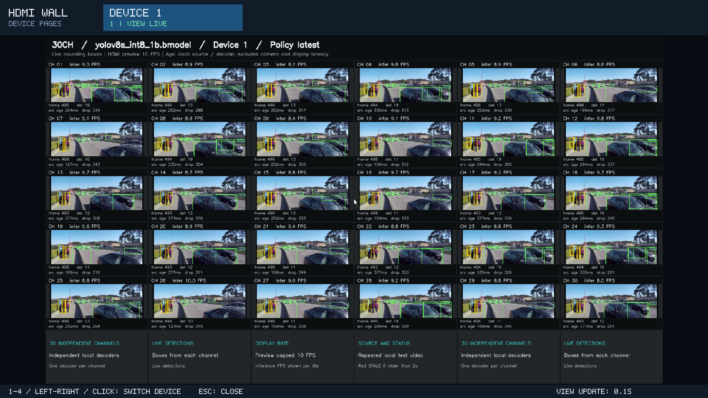
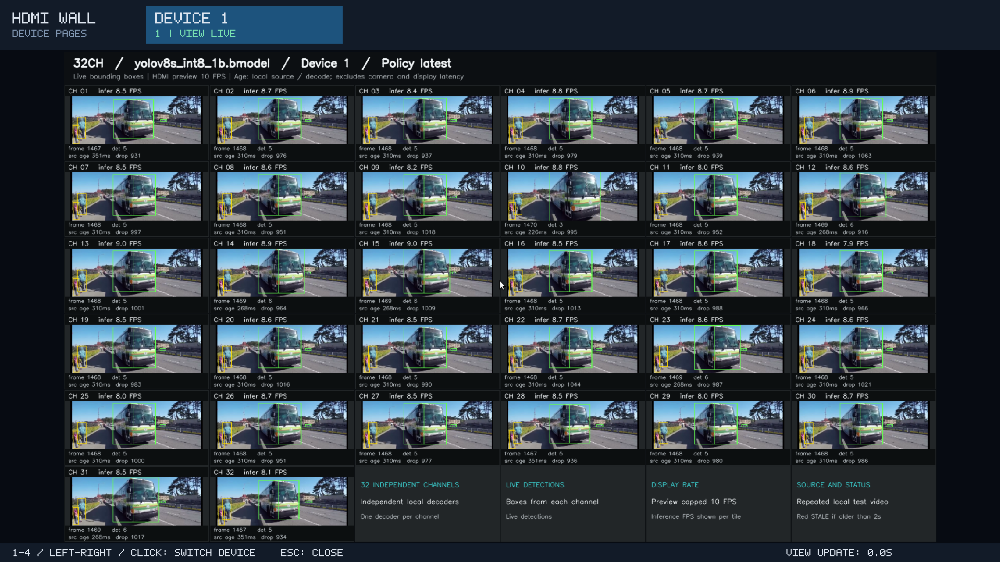

# 单卡 30 路优化实测与连续输出限制

2026-09-09，设备 1 单独运行 30 路、YOLOv8s INT8 batch 1、score gate 开启，使用无损循环延长的 600 秒本地素材完成 **300 秒测试**：总检测吞吐 **270.27 FPS**，每路 **8.92–9.06 FPS**，最差一路结果源帧年龄 P95 **201.50 ms**，TPU 利用率采样平均 **97.25%**。全部 30 路在每个正式 10 秒窗口内都有完成结果。

正式区间内各路相邻完成结果的最大间隔为 **246.88 ms**；但正式开始后，部分通道等待首帧最长 **1.91 秒**。这个启动等待必须与后续结果间隔一起看，P95 只统计已完成结果。预览更新与检测完成仍需分开判断，不能据此保证屏幕全程没有 `STALE`。

同一官方短片上的[60 秒代码对照](#60-秒对照结果)仍保留：197.57 → 260.15 FPS，增加约 31.7%。那两组测试曾在短片 EOF 附近发生长时间断档；600 秒长素材只让本次 300 秒运行避开 EOF，**底层短片循环恢复问题尚未修复**。另有 192 个共同源帧、2,192 个框的[同帧结果一致性](#同帧结果一致性)检查。这些结论均限于本次单卡、本地输入和模型配置。

device 0（PCIe Gen2 ×1）的逐路容量、启动等待和后段连续性单独记录在[设备 0 路数测试](device0-capacity.md)，不套用本页 device 1 的结果。

## 测试条件

| 项目 | 配置 |
|---|---|
| 设备 | RK3588 主机上的单张 BM1684X，device 1，PCIe Gen3 ×2 |
| 路数 | 30 路，每路独立解码并处理同一个本地文件 |
| 原始输入 | 官方 `test_car_person_1080P.mp4`，1920×1080，约 24 FPS，短片约 24.67 秒 |
| 60 秒 A/B | 两组均直接使用同一原始短片，由程序在 EOF 后重新读取 |
| 300 秒测试 | 使用原视频包无重新编码地循环生成的 600 秒素材，分辨率和帧率保持不变，测量期间不遇到文件 EOF |
| 检测模型 | 官方 YOLOv8s INT8 batch 1 |
| Score gate | 开启，板端已准备兼容的辅助 bmodel |
| 调度 | `--policy latest --infer-fps 0 --max-frame-age-ms 250` |
| 时长 | 代码 A/B 各正式 60 秒，长素材正式 300 秒；正式区间前均另预热 3 秒 |
| HDMI | 预览开启，页面更新上限保持 10 FPS；画面与检测框对应同一帧 |
| 入口 | `multi_run.sh --devices 1`，只运行 device 1 并显示一个设备页面 |

这份官方视频约为 24 FPS，与早先 24 路、YOLOv8n、1080p25 公路视频的[抽帧实测](realtime-board-validation.md)不是同一组配置，不能混用其帧率和延时数据。

## 300 秒长素材结果

| 指标 | 优化后代码、600 秒素材 |
|---|---:|
| 正式测量时长 | 300 秒 |
| 检测总完成 FPS | 270.2733 |
| 每路检测完成 FPS 范围 | 8.9200–9.0633 |
| 最差一路结果源帧年龄 P95 | 201.496 ms |
| 全部正式完成结果的源帧年龄均值 / P95 / 最大值 | 143.200 / 197.887 / 368.437 ms |
| 各路每个正式 10 秒窗口都有结果 | 30 路 × 30 个窗口全部非零 |
| 各路正式区间内相邻完成结果的最大间隔 | 246.877 ms |
| 正式开始到各路首个完成结果的最长等待 | 1.910 秒 |
| 正式区间 TPU 利用率有效采样数 | 297 |
| TPU 利用率采样平均值 / P50 / P95 / 最大值 | 97.2525% / 98% / 100% / 100% |
| TPU 利用率不低于 90% 的采样占比 | 287 / 297，96.633% |

相邻结果间隔只比较已经完成的两帧，因此单列正式开始到首帧的等待。程序另有 3 秒预热，部分通道在这之后再等待约 1.91 秒才出现正式结果；从预热开始计约 4.91 秒，不含更早的模型与解码器初始化。这一启动现象没有从报告中扣除。

各通道 `preview_submitted` 记录的相邻提交最大间隔为 **1.682 秒**，位于启动附近；这是每个通道的新预览提交间隔，不是整页到达间隔，预览时序的进一步分析尚未完成。检测结果间隔、页面刷新率与每个格子的实际画面年龄含义不同；本次报告不宣称预览全程没有 `STALE`，也不将源帧年龄当作相机到 HDMI 的端到端延时。

长素材 `data/inputs/hdmi_wall_demo_loop_600s.mp4` 为 **1,093,626,920 字节**，保持原始 1920×1080、约 24 FPS。已核对的 1,184 帧逐帧哈希与原始 592 帧重复两遍完全相同；准备脚本的实际生成及已验证素材缓存复用均成功。它重复原来的场景，未增加独立拍摄内容。

本组改变了素材时长，不能将 197.57 → 270.27 FPS 全部归因于代码优化。隔离代码变化应看[同输入 60 秒 A/B](#60-秒对照结果)；长素材测试用于观察不发生文件 EOF 时的持续处理。运行超过素材长度仍可能进入原有 EOF 恢复路径，因此素材应长于计划正式时长与预热之和。

### HDMI 实际画面



截图来自同配置另一次 30 秒复跑的板子实际桌面，30 个通道均有图像和检测框，采样时刻未见 `STALE`。它保留原始像素，不能用这一张图证明整场运行没有过期画面。各格源年龄包含图像保留至截图时的时间，与上表计到检测完成的年龄不同；顶部 `VIEW LIVE` 只表示拼屏页面仍有更新。

## 设备 1 单卡 32 路扩展测试

保持同一 device 1（PCIe Gen3 ×2）、600 秒素材、s / gate on / latest / infer 0 / age 250 / image auto，将路数改为 32，正式运行 60 秒。**32 路都能检测和显示，但启动阶段出现秒级卡顿，不能把整场运行称为稳定实时。** 这项扩展不替换上述 30 路基准，也不能代表设备 0 或多卡同时运行的能力。

| 指标 | 设备 1，32 路，正式 60 秒 |
|---|---:|
| 检测总完成 FPS | 264.1500 |
| 每路检测完成 FPS 范围 | 7.0333–9.0667 |
| 最差一路已完成结果源帧年龄 P95 | 258.134 ms |
| 全部正式完成结果源帧年龄均值 / 最大值 | 157.341 / 365.542 ms |
| 各路每个正式 10 秒窗口都有结果 | 32 路 × 6 个窗口全部非零 |
| 正式区间 TPU 利用率有效采样数 | 60 |
| TPU 利用率平均值 / P50 / P95 / 最大值 | 96.6667% / 98% / 100% / 100% |
| TPU 利用率不低于 90% 的采样占比 | 55 / 60，91.67% |

逐路时序暴露了完成帧 P95 和固定窗口计数无法表达的启动问题：

- `stream_05`（界面 CH 06）在正式开始后 **9.177 秒**才完成首帧。加上 3 秒预热，从源时钟开始计约 **12.18 秒**，不含模型与解码器初始化。
- `stream_06`（界面 CH 07）已出过结果，随后在正式约 **0.161–5.258 秒**之间发生 **5.097 秒**断档，对应源帧号从 75 到 190。
- 各通道预览提交的相邻最大间隔为 **5.150 秒**。因此，即使之后画面正常、每个 10 秒统计窗口都有结果，也不能隐去启动阶段的连续性问题。

本组使用 600 秒素材，60 秒测量内没有文件 EOF；以上启动现象仍需单独定位，不能与原短片 EOF 恢复问题混为一项。30 路测了 300 秒、32 路测了 60 秒，两者时长不同，不以一次短测的总 FPS 或利用率推断更长时间表现。

<details>
<summary>查看设备 1 单卡 32 路实际 HDMI 页面</summary>



截图来自本次实际运行中的一次采样，32 个通道都有图像和检测框。它说明取样时的显示覆盖，不能推翻日志中已经记录的启动等待和秒级断档。

</details>

## 60 秒对照结果

| 指标 | 优化前代码 | 优化后代码 |
|---|---:|---:|
| 检测总完成 FPS | 197.5667 | 260.1500 |
| 每路检测完成 FPS 范围 | 4.9000–8.5000 | 6.8167–10.5333 |
| 最差一路结果源帧年龄 P95 | 265.137 ms | 244.301 ms |
| 各路每个正式 10 秒窗口都有结果 | 30 / 30 | 30 / 30 |
| 最长相邻完成结果间隔 | 10.53 秒 | 9.11 秒 |
| 短片 EOF 附近出现过 `STALE` | 是 | 是 |
| 正式区间 TPU 利用率有效采样数 | 59 | 59 |
| TPU 利用率采样平均值 | 72.1017% | 94.5085% |
| TPU 利用率采样最小值 / 最大值 | 42% / 84% | 56% / 100% |
| TPU 利用率不低于 90% 的采样占比 | — | 83.05% |

TPU 平均利用率提高约 **22.41 个百分点**。这是正式区间内采样值的统计，不能表述为持续或每次采样都达到 100%；有效吞吐仍以完成检测记录计数为准。

源帧年龄从本地帧计划读取时刻计到检测完成。表中的 P95 **只统计已经完成的帧**，先按通道计算，再取最差一路；它不是全体结果混合后的 P95，不是最大延时，也不能表示没有新结果时屏幕保留画面的年龄。`250 ms` 是送检前的年龄门槛，检测仍需要时间，因此检测完成时的年龄可以超过它。该指标不包含摄像头、网络和显示器的端到端延时。

每个固定 10 秒统计窗口都有结果，不排除断档跨越窗口边界。细查逐路完成时间后，两组均发现 EOF 附近的长间隔，因此不能仅凭窗口非零和较低 P95 宣称画面持续实时更新。后续需要同时检查最长结果间隔、屏幕保留画面的年龄及 `STALE`，并单独验证短片循环恢复行为。

这两组短片测试仍不能作为低延时连续输出验收：最长结果间隔分别为 10.53 秒和 9.11 秒，屏幕曾出现 `STALE`。使用长素材避开测量期内 EOF，没有修复短片循环后的恢复问题。

## 具体改动

1. **设备 YUV 直接进入预处理。** 默认 `--image-path auto` 对支持的设备 YUV 布局使用直接路径，减少生成全尺寸中间 BGR 图像的工作；不支持的布局自动使用 BGR 路径。色彩空间及取值范围沿用当前 SDK 的映射，未知元数据沿用同一 SDK 的默认处理。
2. **复用每个检测器的预处理缓冲。** 固定预处理缓冲由各检测器独立持有，避免逐帧重复分配、释放；各路不共享可变输入缓冲。
3. **缓存视频墙已缩放的小图。** 同一个已提交推理帧再次被页面刷新时，复用缩放结果；新帧到来才重新缩放。画面和框仍保持同帧，年龄、计数及 `STALE` 每次刷新重新计算。

输入解码和推理保留原始输入规格。预览只回传每路 256×144 的 BGR 小图，再在主机组成 1920×1080 页面；这不等于把每路 1080p 原图回传到主机。HDMI 页面更新上限保持 10 FPS，各路新画面的频率仍受实际检测及预览提交速率限制。

本表比较的是三项改动合并后的效果，尚未逐项隔离它们各自贡献的 FPS。程序同时细分记录预览 VPP、回传、画框和提交耗时，用于后续判断同步预览开销。

## 推荐运行与对照

后续在 **device 1、PCIe Gen3 ×2** 上，每次使用下列 **30 路配置作为满载测试基准**。32 路扩展测试单独记录，不替换这一基准；也不将其参数直接当作设备 0 或多卡同时运行的性能承诺。

先完成[环境和资源准备](../../../docs/setup.md)，确认 `bm-smi --noloop` 中 device 1 可用，并重新编译。下面命令在板端执行，适用于已确认 Xorg 使用 `:0`、认证文件为 `/var/run/lightdm/root/:0` 的 LightDM 系统；SSH 普通用户使用完整的 `sudo env`，ADB root 可去掉 `sudo`。其他桌面会话按[连接与显示说明](../README.md#通过-adb-或-ssh-运行到-hdmi)选择实际地址和认证文件。

### 每次使用统一基准入口

`benchmark.sh` 默认选择 **device 1、30 路、正式 300 秒**，固定使用 s / gate on / latest / infer 0 / age 250 / image auto，并自动准备需要的长素材。完成编译和模型准备后，每次执行：

```bash
cd /userdata/1684X-EP-demo
sudo env DISPLAY=:0 \
  XAUTHORITY=/var/run/lightdm/root/:0 \
  SDL_VIDEODRIVER=x11 \
  PLAYER_LIB_PATH=/usr/lib/aarch64-linux-gnu \
  bash demos/hdmi_wall/benchmark.sh
```

只做 32 路扩展时，在同一命令末尾加 `--streams 32`；短测可再加 `--duration 60`。选择设备 0 并扫描路数时加 `--devices 0 --streams N`，其中 `N` 替换为 1–32 的具体整数，路数是否合适需依据该设备独立实测。原来的单设备和多设备入口默认值保持不变；这里是单独固定参数的基准入口。

基准入口允许设置设备、路数和时长，不接受模型、输入文件或抽帧参数覆盖；另可用 `--gate-merge-budget-kib 0..1024` 对照小块回传合并，默认 0，本页设备 1 的历史性能表均保持该基准。设备 0 的 64 KiB 实验单列在[设备 0 报告](device0-capacity.md#20-路64-kib-小块回传合并)。自动素材时长至少覆盖正式时长、3 秒预热和额外 60 秒，并向上取到 600 秒的整数倍；默认生成或复用 600 秒文件，正式 600 秒或 900 秒时准备 1,200 秒文件。

停止使用相同身份执行：

```bash
sudo bash demos/hdmi_wall/benchmark.sh --stop
```

`--stop` 直接执行多设备入口的收尾，不重新准备素材。查看规划可加 `--dry-run`，不会启动硬件或生成文件。

### 展开的 300 秒运行命令

需要明确查看准备和运行两步时，等价配置如下：

```bash
cd /userdata/1684X-EP-demo
bash demos/hdmi_wall/build.sh
sudo bash scripts/prepare_hdmi_loop.sh --seconds 600
sudo env DISPLAY=:0 \
  XAUTHORITY=/var/run/lightdm/root/:0 \
  SDL_VIDEODRIVER=x11 \
  PLAYER_LIB_PATH=/usr/lib/aarch64-linux-gnu \
  bash demos/hdmi_wall/multi_run.sh \
  --devices 1 --streams 30 --model s --score-gate on \
  --input data/inputs/hdmi_wall_demo_loop_600s.mp4 \
  --policy latest --infer-fps 0 --max-frame-age-ms 250 \
  --image-path auto --duration 300
```

这条命令复现已完成的 300 秒长素材配置。准备脚本采用视频包复制而非重新编码，已存在且通过哈希核对的同配置素材会直接复用；生成文件和辅助模型均留在本地，不进入 Git。以 sudo 启动时，停止也使用相同权限。

每次按上面的完整配置运行，`--infer-fps 0` 都会取消人为设置的检测启动上限，仍使用 `latest` 主动抽帧：每路待检测槽仅保留最新一帧，旧候选帧被覆盖，超龄帧被淘汰。它既不表示关闭抽帧，也不保证逐帧检测源视频、每个瞬间 TPU 都到 100%，或自动让其他设备满载。实际吞吐与利用率仍取决于输入、模型、设备及主机负载。

辅助文件 `data/models/score_gate/score_gate_reducemax_f32.bmodel` 不随 Git 下载，本次板端已经准备；新机器需先准备与检测输出布局匹配的辅助模型。没有该文件时不能直接复现本表的 `score-gate on` 配置，改成 `off` 后需要重新测量。

若要隔离图像路径差异，先停止当前运行，再用相同配置将 `--image-path auto` 改成 `--image-path bgr`：

```bash
cd /userdata/1684X-EP-demo
sudo bash demos/hdmi_wall/multi_run.sh --stop
sudo env DISPLAY=:0 \
  XAUTHORITY=/var/run/lightdm/root/:0 \
  SDL_VIDEODRIVER=x11 \
  PLAYER_LIB_PATH=/usr/lib/aarch64-linux-gnu \
  bash demos/hdmi_wall/multi_run.sh \
  --devices 1 --streams 30 --model s --score-gate on \
  --input data/inputs/hdmi_wall_demo_loop_600s.mp4 \
  --policy latest --infer-fps 0 --max-frame-age-ms 250 \
  --image-path bgr --duration 300
```

新代码下的 `bgr` 对照仍包含预处理缓冲复用和小图缓存，因此不等于上表“优化前代码”的完整基线。实际选择的图像路径、色彩元数据和预处理映射可从输出记录核对。

上面 BGR 命令是相同长素材配置的对照方法，本页尚未列出该配置的 300 秒 BGR 结果。复现原始 60 秒短片条件时，两条路径均须改回官方 `test_car_person_1080P.mp4` 和 `--duration 60`，并保留短片 EOF 断档的限制。

## 同帧结果一致性

另以单路 `all` 策略、25% 检测阈值、正式 5 秒和预热 3 秒，运行实际完整流水线，对照 `--image-path bgr` 与 `--image-path auto`。按源帧对应后，两次运行共有 **192 帧、2,192 个检测框**：每帧检测框数量、类别、分数及坐标均完全一致。

这验证了本次输入和配置下两条处理路径的同帧结果一致性。它没有使用标注数据计算准确率、召回率或 mAP，因此不能作为业务场景准确率验收，也不能推断其他视频、色彩元数据或输入布局必然得到相同结果。

对应 run ID：BGR 为 `20260909T075036Z-fd343da3`，auto 为 `20260909T074702Z-df76717c`。这组单路逐帧对照与上面的 30 路抽帧性能测量用途不同，不能混算吞吐或连续输出结果。

## 原始记录与后续验证

| 运行 | run ID |
|---|---|
| 优化前代码，60 秒 | `20260909T073724Z-2db064f1` |
| 自动 YUV 路径、缓冲复用、小图缓存，60 秒 | `20260909T074729Z-978d0e13` |
| 优化后代码、600 秒素材，正式 300 秒 | `20260909T080315Z-df7a4e72` |
| 设备 1 扩展 32 路、600 秒素材，正式 60 秒 | `20260909T081131Z-7d8f4107` |

上述设备 1 原始数据位于板端仓库的 `data/results/hdmi-wall-multi/<run-id>/device_1/`，包含逐路检测记录、summary、worker 日志和页面截图；运行根目录保存多设备启动配置及 viewer 状态。300 秒测量的采样任务标识为 `20260909T080314Z-optimized30-long300`。原始结果不随 Git 下载。重新测试时同时检查全部通道的完成帧率、空窗口、最长结果间隔、首帧等待、源帧年龄与丢帧统计，不能只看 TPU 利用率。

仍待解决或进一步验证的是短片 EOF 后的连续输出恢复、启动阶段预览时序，以及切换输入规格后的行为。长素材测试不能代替短片 EOF 恢复验证。多卡同时运行和真实 RTSP 摄像头需要各自验证，不能直接套用本页单卡结果。
