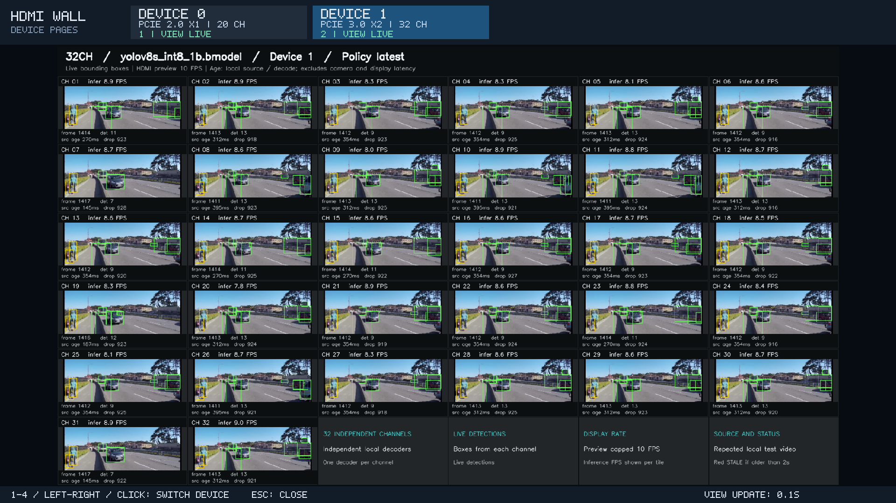

# 四小时多设备展示

`showcase.sh` 把长素材准备、设备识别、每卡配置、分页显示和利用率采样放进一个入口，默认正式运行 **14,400 秒（4 小时）**，另有 3 秒预热、初始化和收尾。所有选中的卡同时工作，顶部每张卡一个按钮；切页后其他卡仍继续解码、推理和更新预览。每卡可配置 1–32 路，最多选择 4 张卡。

本板两种模式都已完成双卡并发 **120 秒**测试。需要 TPU 接近满载时，推荐 **`stress` 的 20 + 32 路**：Gen2 ×1 / Gen3 ×2 TPU 采样平均分别为 **97.59% / 100%**。需要每卡完整 32 路页面时，使用 **`showcase` 的 32 + 32 路**，两页共 64 路持续显示和检测，Gen2 ×1 TPU 平均为 **84.61%**。完整数据见[两种模式并发对照](#双卡展示与压测并发实测)。**默认四小时是运行时长，尚未完成四小时验收。**

单卡历史测量分别见 [device 1 的 30 路基准](performance-30.md)和 [device 0 路数及回传预算对照](device0-capacity.md)。多卡共享主机资源，应按同时运行的结果判断各卡实际速度，不能直接相加单卡结果。

## 启动与停止

先完成[环境与资源准备](../../../docs/setup.md)并编译 `demos/hdmi_wall/build.sh`。本入口固定使用 **YOLOv8s INT8 batch 1、score gate on、latest、infer FPS 0、送检最大年龄 250 ms、image auto、本地解码预取 prime on、summary 记录**。辅助 score-gate bmodel 必须已准备在 `data/models/score_gate/score_gate_reducemax_f32.bmodel`；它不随 Git 分发。`infer-fps 0` 取消检测限速，`latest` 仍会主动丢弃被新帧覆盖或送检前过期的帧，不保证每路达到输入帧率，也不保证 TPU 每次采样都为 100%。

以下在板端 `/userdata/1684X-EP-demo` 执行，适用于已确认 Xorg 为 `:0`、LightDM 认证为 `/var/run/lightdm/root/:0` 的系统。其他会话先按 [ADB / SSH 显示说明](../README.md#通过-adb-或-ssh-运行到-hdmi)选择正确认证；ADB root 可省略 `sudo`。

本板推荐先使用 `stress` 检查满载效果。先查看实际设备、PCIe 链路、各卡路数与完整命令：

```bash
cd /userdata/1684X-EP-demo
sudo env DISPLAY=:0 \
  XAUTHORITY=/var/run/lightdm/root/:0 \
  SDL_VIDEODRIVER=x11 \
  PLAYER_LIB_PATH=/usr/lib/aarch64-linux-gnu \
  bash demos/hdmi_wall/showcase.sh --devices auto --mode stress --dry-run
```

正式启动压测模式（默认四小时）：

```bash
cd /userdata/1684X-EP-demo
sudo env DISPLAY=:0 \
  XAUTHORITY=/var/run/lightdm/root/:0 \
  SDL_VIDEODRIVER=x11 \
  PLAYER_LIB_PATH=/usr/lib/aarch64-linux-gnu \
  bash demos/hdmi_wall/showcase.sh --devices auto --mode stress
```

`--devices auto` 从板端 sysfs 发现 1–4 张实际设备；也可写 `--devices 0,1` 或只选 `--devices 1`。不连续的设备编号同样支持。每张卡从其真实设备路径查找最近的 PCIe BDF 父节点，读取 `current_link_speed` 和 `current_link_width`，不会根据“device 0”或“device 1”猜链路规格。`--dry-run` 会读取这些真实信息，但不生成素材或启动工作进程。

HDMI 顶部各卡按钮显示实际链路和配置路数，例如 `DEVICE 0` / `PCIE 2.0 X1 | 32 CH`，并保留该页的等待、更新或错误状态；`viewer-status.json` 同时保存 `pcie_link_label` 和 `streams`。普通入口没有传入真实 PCIe 信息时保持原来的设备编号显示，不补猜链路。

下图为板端 HDMI 截屏：当前查看 device 1 的 32 路页面，device 0 的 20 路也在后台运行，两个按钮均显示 `VIEW LIVE`。



点击顶部按钮、按数字 `1`–`4` 或左右键切页；数字对应页面顺序。按 `Esc`、关闭窗口或在启动终端按 `Ctrl+C`，会先停止各卡工作进程并写出汇总，再结束显示程序。也可在另一终端以相同权限停止：

```bash
cd /userdata/1684X-EP-demo
sudo bash demos/hdmi_wall/showcase.sh --stop
```

`--stop` 不准备素材。`--duration 300` 可改为正式运行 300 秒。旧的 `run.sh`、`multi_run.sh` 和 30 路 `benchmark.sh` 默认配置不受此入口影响。

## 展示与压测档位

`--mode showcase` 为默认模式，优先每卡显示 32 路；`--mode stress` 使用本板负载测量选出的路数。两种模式均让所有选中的卡同时工作，并保留同帧画框、页面预览与切换；都默认正式运行四小时、prime on、summary 记录和约 5 秒一次的遥测。

| 实际 PCIe 链路 | `showcase` 路数 / 合并预算 | `stress` 路数 / 合并预算 |
|---|---|---|
| Gen2 ×1 | 32 路 / 128 KiB | 20 路 / 64 KiB |
| Gen3 ×2 | 32 路 / 64 KiB | 32 路 / 64 KiB |
| 其他或未知档位 | 32 路 / 64 KiB，标记 `unvalidated_fallback` | 32 路 / 64 KiB，标记 `unvalidated_fallback` |

档位按 sysfs 实际链路选择，不按设备编号选择。未知链路的后备配置未做容量认证；链路读取本身失败会明确报错。显式 profile 中逐卡字段优先于默认档位。`stress` 的名称不保证每卡利用率达到 100%，也不保证减少路数后总吞吐一定提高。

需要每卡 32 路的展示模式时，在同一板端环境执行：

```bash
cd /userdata/1684X-EP-demo
sudo env DISPLAY=:0 \
  XAUTHORITY=/var/run/lightdm/root/:0 \
  SDL_VIDEODRIVER=x11 \
  PLAYER_LIB_PATH=/usr/lib/aarch64-linux-gnu \
  bash demos/hdmi_wall/showcase.sh --devices auto --mode showcase
```

不要叠加启动两个模式；先停止上一场，再启动下一场。20 + 32 路压测与 32 + 32 路展示都已完成下方的双卡 120 秒对照，推荐只适用于本板已测条件，四小时持续性仍需完整长测。

## 每卡独立配置

用 `--profile <JSON 文件>` 分别设置各卡的路数和小块回传合并预算。未覆盖的字段使用上述模式对应的链路档位；以 `--dry-run` 输出的 `device_configuration.devices` 为准。

例如把以下内容保存为 `data/config/hdmi-showcase.json`：

```json
{
  "devices": {
    "0": {"streams": 32, "gate_merge_budget_kib": 128},
    "1": {"streams": 32, "gate_merge_budget_kib": 64}
  },
  "context": {"note": "本板双卡 120 秒展示参数，未完成四小时认证"}
}
```

这是本板双卡 120 秒展示参数的配置示例，不等于已经通过四小时测试。这里 `0` / `1` 是本板编号，换机需要按实际设备对应关系设置；自动模式无需手工绑定这些编号。字段 `streams` 支持 1–32，`gate_merge_budget_kib` 支持 0–1024 KiB；64 表示每帧额外合并读取最多 65,536 字节。profile 可列出全部设备，只运行 `--devices` 选中的部分。

使用该配置的完整命令为：

```bash
cd /userdata/1684X-EP-demo
sudo env DISPLAY=:0 \
  XAUTHORITY=/var/run/lightdm/root/:0 \
  SDL_VIDEODRIVER=x11 \
  PLAYER_LIB_PATH=/usr/lib/aarch64-linux-gnu \
  bash demos/hdmi_wall/showcase.sh \
  --devices 0,1 --profile data/config/hdmi-showcase.json
```

最终生效的逐卡参数及 PCIe 信息写入 `data/results/hdmi-showcase/<config-id>/device-config.json`，并随运行保存到 `data/results/hdmi-wall-multi/<run-id>/run.json`。不要只记录页数，比较性能时要同时保留每路检测 FPS、启动首帧等待、持续无结果间隔、源年龄和 TPU 采样。

## 双卡展示与压测并发实测

2026-09-09，本板两张 BM1684X 同时运行，每种模式正式 120 秒，使用本地长素材、s / gate on / latest / infer 0 / age 250 / auto / prime on / summary。device 0 的实际链路为 Gen2 ×1，device 1 为 Gen3 ×2。结果分别位于 `data/results/hdmi-wall-multi/<run-id>/device_0/` 和 `device_1/`。

| 正式测量指标 | showcase：Gen2 ×1 | showcase：Gen3 ×2 | stress：Gen2 ×1 | stress：Gen3 ×2 |
|---|---:|---:|---:|---:|
| 路数 / 合并预算 | 32 / 128 KiB | 32 / 64 KiB | 20 / 64 KiB | 32 / 64 KiB |
| 总检测完成 FPS | 234.1583 | 273.4333 | 282.6333 | 274.3000 |
| 每路检测完成 FPS 范围 | 7.1667–7.4833 | 8.4917–8.6083 | 14.0583–14.2167 | 8.5333–8.6083 |
| 最差一路完成帧源年龄 P95 | 258.059 ms | 206.118 ms | 140.125 ms | 197.073 ms |
| 最大相邻检测完成间隔 | 0.251398 秒 | 0.213996 秒 | 0.146369 秒 | 0.204365 秒 |
| 正式开始到首帧最长等待 | 0.188142 秒 | 0.141542 秒 | 0.077752 秒 | 0.069278 秒 |
| 正式 TPU 利用率采样平均 | 84.6102% | 99.4237% | 97.5932% | 100% |
| 正式有效 TPU 采样数 / 峰值 | 59 / 96% | 59 / 100% | 59 / 100% | 59 / 100% |

展示运行 ID 为 `20260909T091626Z-91e318ad`，压测为 `20260909T091927Z-d8c6351c`。两种模式的两卡均 `accounting_complete=true`，均没有创建逐帧 `detections.jsonl`，与 summary 配置一致。压测组 Gen2 ×1 的正式 TPU 最低采样为 92%；Gen3 ×2 的 59 次正式采样均为 100%。这是离散采样结果，不能据此证明每个瞬间都满载。本表保留实际采样数，不把它等同默认四小时入口的 5 秒采样节奏。

压测还验证了两页的真实 PCIe 标签和 20 / 32 路配置，切页 4 次，两页各收到超过 1,200 张完整拼屏画面；隐藏页也持续接收。这里是整页接收次数，不是每路检测帧数。32 + 32 路展示满足本轮每卡 32 路页面需求，20 + 32 路压测在本板取得更高 TPU 利用率与 Gen2 ×1 检测吞吐，保留两种用途。

首帧等待从正式起点算起，应另加 3 秒预热及之前的初始化；源年龄只统计完成帧，最大检测间隔也不是屏幕端延时。120 秒结果不能外推到四小时、四张卡或独立实时摄像头。prime 的单卡启动改善与同帧结果核对见[解码预取实测](device0-capacity.md#32-路本地解码预取改善启动)。

## 长素材与磁盘空间

入口自动准备至少覆盖“正式时长 + 3 秒预热 + 60 秒余量”的素材，再向上取整到 600 秒。默认四小时会使用 **15,000 秒**的 `data/inputs/hdmi_wall_demo_loop_15000s.mp4`。准备过程重复官方本地视频的压缩包，不重编码，保留原 1920×1080、约 24 FPS 的视频规格；各通道独立读取同一份素材，不是同等数量的独立摄像头。

生成前，脚本根据**源文件字节数 ÷ 探测时长 × 目标时长**估算输出大小，并要求输出盘可用空间至少为“估算输出 + 5% + 1 GiB”。stderr 会打印估算、包含余量的需求以及实际可用字节。空间不足时，在启动 ffmpeg 和创建临时素材前退出，不留下本次的部分视频；已有素材及校验清单匹配时先验证复用，不因剩余空间不足再拒绝同一份缓存。

本次已生成的 600 秒素材为 1,093,626,920 字节；按该规模估算，15,000 秒约 **27.34 GB（25.46 GiB）**，加上述余量约需 **27.74 GiB** 可用空间。实际预检以当前源文件和输出盘为准，已有其他素材仍占磁盘。首次生成和复用时的完整文件校验也需要时间，素材准备时间不计入正式四小时。

长素材让运行期间不触及短片 EOF；短片 EOF 后解码恢复的问题本身没有因此修复。改变运行时长应交给入口重新选择足够长的素材，不能把一份 600 秒文件用于四小时测试后仍声称避开了 EOF。

## 四小时的记录方式

`summary` 模式保留同帧检测框、10 FPS 页面预览和逐路统计，但不创建 `detections.jsonl`，避免把整场所有帧的框逐条写盘。各卡仍输出 `summary.json`、`streams.csv`、逐路 `summary.json`、`status.json` 和工作日志；统一页面状态由根目录的 `viewer-status.json` 记录。需要完整逐帧框对照时，另用支持 `--record-mode full` 的普通入口做有明确时长的测量。

| 结果 | summary 模式口径 |
|---|---|
| 完成帧数、FPS、丢帧数、每个时间窗口计数 | 保留全部计数 |
| 每个耗时或年龄指标的 count、sum、mean、max | 使用全部观测 |
| 每个耗时或年龄指标的 P50 / P95 / P99 | 每指标最多保留 4,096 个 Algorithm R 蓄水池样本；超过容量后为近似分位数 |
| 首帧等待、最大相邻检测完成间隔、末尾间隔 | `analysis_completion_continuity` 精确统计正式区间内的检测完成时刻，早于预览与可选记录 |
| `records_written` / `records_complete` | 分别为 0 / null，表示未启用逐帧记录；完整性查看 `accounting_complete` |

每个指标带 `sample_size`、`sample_capacity`、`percentile_method`、`percentiles_approximate`，根目录 `metric_statistics` 说明统计方式。未超过容量时保留全部样本，超过后不能把 P95 标作全帧精确值。每指标保存的样本数不随帧数继续增加。检测完成间隔的时间点与预览后完成计数略有不同，边界可能相差一帧；这些指标均不是显示器端延时。

## 利用率和状态采样

默认每卡约 **5 秒**查询一次 `bm-smi`，卡与卡错开采样；查询耗时与主机调度会改变实际间隔，遗漏的采样不会补写。可用 `--telemetry-interval 10` 调整，0 关闭。原始结果保存在当前多设备运行目录的 `telemetry.jsonl`，退出后汇总到 `telemetry-summary.json`。

每次采样记录设备编号、时间、TPU 利用率、查询耗时、磁盘剩余、主机可用内存，以及该卡最近 wall 状态中的有图通道数和 `STALE` 数；读取失败保留错误和空值，不当作 0% 利用率。wall 状态自身约 5 秒更新一次，读取到相同时间戳不能当成新的独立画面。

`telemetry-summary.json.devices` 汇总包含启动阶段的全部采样；`formal_measurement.devices` 则按每卡 `summary.json` 的 `[measurement_start_monotonic_s, observed_measurement_end_monotonic_s)` 自动筛选，保留采样数、有效值数、读取失败数、最小 / 最大 / 平均利用率及 `worker_summary_status`。同一份汇总也保存在 `run.json.telemetry`。采样的区间归属使用 `bm-smi` 查询开始时的单调时钟时间，查询可能跨越区间边界，不能当作每个瞬间的连续测量。

与性能报告的“正式 TPU 平均”比较时，应使用正式区间值并核对有效采样数，不能混用整场平均。没有观察到 `STALE` 也只能说明采样覆盖的状态，不能证明采样之间没有短暂停顿；页面持续收到画面同样不能代替每路源年龄检查。各记录字段、计数时间点、近似分位数和实验解码预取元数据的完整定义见[指标文档](../../../docs/metrics.md)。
