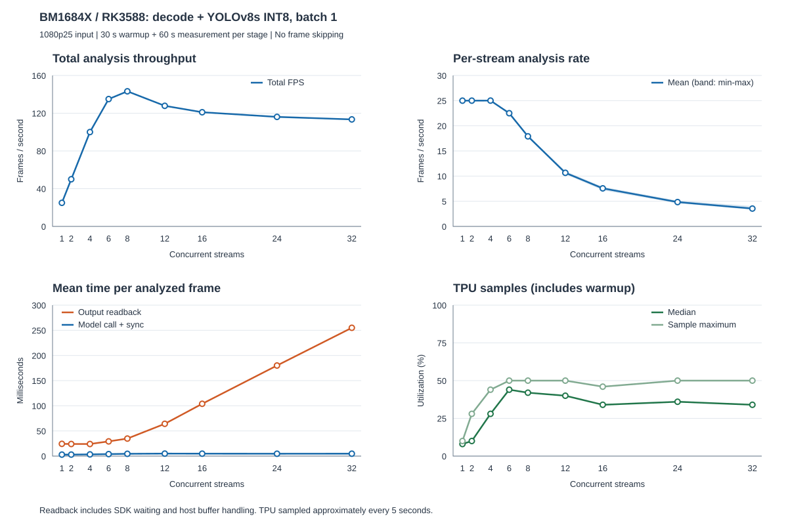

# 单卡解码＋推理：路数递增测试

测试编号：`20260907_162215_109913`。RK3588 + 单张 BM1684X（device 1，PCIe 3.0 ×1），YOLOv8s INT8 batch 1，640×640 模型输入。视频为 1080p25 H.264 BBB 动画，使用 device-bgr 路径，每帧推理并写检测 JSON。

按 1、2、4、6、8、12、16、24、32 路依次测试，每档预热 30 秒、采集 60 秒、窗口 30 秒；前一档全部进程收尾后再启动下一档。保持原始输出缓冲分配方式，不限制回传并发，不抽帧、不画框、不编码。

## 测试结果

| 路数 | 总 FPS | 平均每路 FPS | 最低逐路窗口 FPS | TPU 中位数 | TPU 采样峰值 | 输出读取 ms/帧 |
|---:|---:|---:|---:|---:|---:|---:|
| 1 | 24.99 | 24.99 | 24.98 | 8% | 10% | 24.34 |
| 2 | 49.99 | 24.99 | 24.98 | 10% | 28% | 24.04 |
| 4 | 100.02 | 25.01 | 24.97 | 28% | 44% | 24.03 |
| 6 | 134.99 | 22.50 | 22.07 | 44% | 50% | 29.22 |
| 8 | 143.22 | 17.90 | 17.39 | 42% | 50% | 34.84 |
| 12 | 127.82 | 10.65 | 10.19 | 40% | 50% | 64.17 |
| 16 | 121.02 | 7.56 | 7.02 | 34% | 46% | 103.95 |
| 24 | 116.09 | 4.84 | 4.45 | 36% | 50% | 180.02 |
| 32 | 113.43 | 3.54 | 3.03 | 34% | 50% | 255.02 |

TPU 每档有 19 次有效采样，间隔约 5 秒，包含预热和启动/收尾。中位数不是正式采集区间的连续时间平均，采样峰值也不是未间断监测得到的绝对峰值。FPS 和处理耗时仅统计正式采集区间，耗时为各路均值等权平均。

## 结论

- 1～4 路在本次短测中接近每路 25 FPS；这不是长期承载容量验收。
- 本轮已测档位中，8 路总吞吐最高，为 143.22 FPS，平均每路 17.90 FPS。
- 继续加到 12～32 路，总吞吐逐步降至约 113.43 FPS，同时输出读取等待明显增加。
- TPU 采样中位数在 6～8 路约为 42%～44%，32 路约为 34%；增加路数没有把 TPU 跑满。

模型推理调用及同步均值约 2.94～4.95 ms，CPU 筛框/NMS/坐标还原约 1.87～2.76 ms。输出读取从单路约 24 ms 增到 32 路约 255 ms，是当前实现中最值得优化的路径。这里包含主机缓冲申请、SDK 取回及内部等待，尚不能单独判定 PCIe 物理链路已耗尽。

## 调用方式与并发的含义

当前每路独立进程、模型和解码器，单路内部按解码、推理、回传、后处理顺序执行。并发进程共享同一张卡、驱动和 PCIe 通道。结果表明这种实现扩展到更多路时效率下降；目前没有证据证明存在数据竞争、错误绑定设备或某个 SDK 接口参数错误。

9 档均正常完成，83,346 条检测记录的帧编号和 worker 汇总核对完整，全部收尾退出码为 0。完整性核对不等于业务检测精度评估，也不排除尚未定位的性能问题。

优化应分别验证缓冲区复用、输出数据量缩减以及跨阶段流水线，保持模型和检测语义可对照。只增加进程数或追求 TPU 显示 100% 不能保证实际吞吐提高。

## 复测与数据

逐档执行命令见[操作说明](single-card-analysis.md)。[原始统计数据](../benchmarks/20260907/20260907_162215_109913/ladder.csv)、[逐路数据](../benchmarks/20260907/20260907_162215_109913/streams.csv)和[测试参数](../benchmarks/20260907/20260907_162215_109913/metadata.json)可直接在 GitHub 查看。

输出缓冲复用的实现和对照见[缓冲区测试](analysis-buffer-reuse-20260907.md)。

## 推理链路定位

现有 inference 计时覆盖模型提交、`bm_thread_sync` 和输入 tensor 释放，不是芯片内部各算子的纯执行时间。输出读取在其后单独计时，CPU 后处理又单独统计；不能把全部输出读取耗时直接归因于物理 PCIe 传输。

同模型 batch 1 的[独立计算对照](analysis-optimization-20260907.md)为 354.50 图/秒，但不包含逐帧视频输入输出和完整检测流程。这说明当前视频链路与独立计算之间存在差距，不能据此排除推理调度或 SDK 等待问题。

后续应在相同设备、模型哈希和 SDK 版本下，从单路开始对齐原厂基线：分别检查模型提交、完成同步、输出读取，再用原厂支持的 profiling 工具定位算子执行和驱动等待。重点确认原厂基线是否包含输出回传与 NMS、是否采用共享模型或 batch，以及输出张量格式是否一致。尚未完成这组 profiling，暂不认定为接口调用错误、TPU 算力不足或 PCIe 带宽耗尽。
