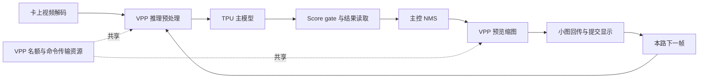

# 双卡推理与预览性能诊断（2026-09-28）

本次针对用户确认的「现有 YOLOv8 视频墙，检测结果＋视频预览」进行现场复测。服务器 `192.168.5.44`，部署目录 `/userdata/1684X-EP-demo`。这是性能诊断报告，不是已批准的产品需求、技术规格或默认配置变更。

**本页保留初轮实验及当时结论。后续已完成驱动内部分账、隐藏解码 VPP 请求定位与解码格式干预，最终解释和解决方案见 [VPP 根因报告](../vpp-root-cause.md)。下文“尚未量化”“本轮未变速”等陈述仅指本页记录的初轮实验。**

后续对「32 路如何并发、139.471 ms 是否每路相同、PCIe 理论时间是否吻合」的逐项计算及同尺寸纯 D2H 补测，见 [并发与 PCIe 2.0 理论核验](pcie2-theory-and-concurrency.md)。

**应用层触发因素已通过对照确认：同步预览进入推理循环，增加 VPP 工作与共享路径等待，PCIe 2.0 ×1 对这种混合负载更敏感。不能把现象简单归为「结果数据把 PCIe 带宽打满」。驱动内部各类等待对两卡差距的贡献尚未完全量化，不能宣称已定位唯一底层根因。**

对「像素在卡上，为什么预处理仍受 PCIe 影响」的后续补测见 [预处理调用分账](preprocess-wait-verification.md)：两步 API 均存在差距，但这些指标包含等待，不代表 VPP 纯计算时间；当前输入类型的 `convert_to` 在现场 SDK 中也走 VPP 路径。

## 现场与测试口径

- 现场实际枚举三张 BM1684X：device 0=`0002:21:00.0`，5 GT/s ×1；device 1=`0004:41:00.0`，5 GT/s ×1；device 2=`0003:31:00.0`，8 GT/s ×1。本次测试 0、2，设备 1 保持空闲。
- 驱动 0.5.1 LTS，运行模块 srcversion `9C14781EC1530C39E702F94`；磁盘模块 SHA256 `fcf71e84f0797371ec85e9d6989c71d7a58162134e3ffa7dd8f26687205a40d9`，与前期调查记录一致。
- 现场原先没有业务推理负载。本次未更换驱动、调整 PCIe 链路或修改生产代码、默认配置。
- 两卡同时各 32 路，官方 1080p24 长视频、YOLOv8s INT8 batch 1、latest、250 ms 送检年龄门槛、score gate 开启、候选读取合并预算 64 KiB、输出缓冲 reuse。
- 全部视频墙对照使用同一个已部署 `build-async/hdmi_wall.pcie`，结果回传始终开启。每阶段预热 30 秒，首轮正式 45 秒，验证轮正式 60 秒。两卡分别启动，实际正式窗口重叠时间由原始时间戳计算。
- 为诊断使用两路独立 ffplay 消费输出，均输出 1920×1080 页面、10 FPS 页面上限；它不同于统一双卡展示器。检查了生成的视频墙图像及逐秒状态，不把它等同于物理 HDMI 连续目视验收。
- 每路预览上限、实际预览 FPS、模型检测 FPS、页面刷新率是不同指标。关闭预览仍运行主模型、gate、结果读取与 NMS。

## 229 FPS / 84.3% 与 272 FPS / 99.5% 的计算复核

以下全部使用首轮同步预览的正式 45 秒窗口，排除预热。每张卡有 32 个独立处理循环，预览上限均为每路 10 FPS。

| 原始计数与结果 | PCIe 2.0 ×1，device 0 | PCIe 3.0 ×1，device 2 |
|---|---:|---:|
| 完成检测次数 N | 10,314 | 12,228 |
| N ÷ 45，总检测 FPS | 229.20 | 271.73 |
| TPU 有效采样数 | 45 | 45 |
| TPU 采样平均 U | 84.3111% | 99.4667% |
| 完成小图数 | 6,844 | 8,968 |
| 小图数 ÷ 45 ÷ 32，实际预览 FPS/路 | 4.753 | 6.228 |
| 最低单路检测 FPS | 6.956 | 8.400 |
| 最长无检测结果间隔 | 0.262 s | 0.212 s |
| 过期丢帧（含预热和收尾） | 0 | 0 |

PCIe 2.0 的检测吞吐低 `(271.7333−229.2)/271.7333=15.65%`。设置预览上限 10 FPS 并不代表两边实际都产生 10 FPS/路的小图。

### 核算一：算力本身是否不同

用 `1000×U/FPS` 得到每完成一次检测对应的**等效 TPU 忙碌毫秒数**：

- PCIe 2.0：`1000×0.843111/229.2 = 3.6785 ms/次`。
- PCIe 3.0：`1000×0.994667/271.7333 = 3.6605 ms/次`。

两者仅差约 0.49%。该指标来自占用率采样，包含主模型、gate、其他 TPU 工作，**不是直接测得的主模型硬件执行时间**。它是一致性检查，不能单独证明因果。

假设每次检测的 TPU 工作量保持相近，PCIe 2.0 满载吞吐应约 `229.2/0.843111=271.85 FPS`。独立关闭预览、保留结果回传的实测为 **273.38 FPS / 99.33%**，与该估计仅差 **0.56%**。驻留计算的两卡 371.78 / 372.23 次/s 也几乎一致。三组数据共同支持：差距主要来自没有持续供给 TPU，而不是这张卡计算能力只有另一张的 84%。

45 秒窗口按采样占用率折算，PCIe 2.0 TPU 空闲约 `45×(1−0.843111)=7.06 s`，PCIe 3.0 约 `0.24 s`。这仍是采样估算，不是事件级时间线。

### 核算二：用独立的阶段计时复算 FPS

下表为各路时间累加后除以该卡正式完成检测总数 N；预览按**全部检测次数摊销**，没有把「每张小图」时间直接加到「每次检测」时间上。各项是包含排队的主控线程墙钟时间。

| 每次检测摊销，ms | PCIe 2.0 ×1 | PCIe 3.0 ×1 | PCIe 2.0 减 PCIe 3.0 |
|---|---:|---:|---:|
| 预处理 | 60.899 | 18.470 | +42.429 |
| 主模型提交与同步 | 24.689 | 44.587 | −19.898 |
| 后处理整段，含 gate、结果读取、CPU NMS | 34.371 | 47.488 | −13.117 |
| 图像桥接和检测调用其他开销 | 0.024 | 0.024 | 约 0 |
| 同步预览整段摊销 | 19.488 | 7.118 | +12.371 |
| **合计 C：service_ms＋preview_ms** | **139.471** | **117.687** | **+21.784** |

32 路处理循环近似持续繁忙时，全卡吞吐估算 `F≈32×1000/C`：

- PCIe 2.0：`32000/139.471116=229.438 FPS`，实测 **229.200**，误差 **0.104%**。
- PCIe 3.0：`32000/117.687253=271.907 FPS`，实测 **271.733**，误差 **0.064%**。

交叉检查：`FPS×C/1000` 分别为 **31.967、31.980 个线程**，接近实际 32 路。未计入的循环管理、等待取帧及窗口边界影响很小。本次可以解释约 42.53 FPS 的吞吐差；不应把此公式无条件套到异步预览、不同路数或大量断供的场景。

这里每路累计约 118–139 ms，多个线程同时排队和执行；**不能用 `1000/C` 当全卡 FPS，也不能把累计线程等待当成硬件占用时间**。解码由独立线程进行，因此不能再把 decode_ms 串行加到这个循环里。`service_ms` 已包含预处理、主模型、后处理，计算时也不能重复相加。

为什么 PCIe 3.0 的主模型和 gate 同步时间反而更长？其输入供给更连续，TPU 持续忙碌，多个任务在计算队列里等待。PCIe 2.0 在前处理与预览路径滞留更多，TPU 队列较容易缺任务；同步返回更快不能解释为计算更快。该队列解释与占用率和对照结果一致，但本轮没有逐任务硬件排程轨迹。

### 核算三：结果大小、调用次数与读取时间

| 检测结果读取 | PCIe 2.0 ×1 | PCIe 3.0 ×1 |
|---|---:|---:|
| 正式结果总字节数 | 1,225,456,176 | 1,454,021,856 |
| 平均结果字节/检测 | 118,814.83 | 118,909.21 |
| 候选读取次数/检测 | 10.624 | 10.672 |
| 分数读取墙钟 ms/检测 | 1.498 | 0.547 |
| 候选读取墙钟合计 ms/检测 | 9.042 | 3.162 |
| 两项读取墙钟合计 | **10.541 ms** | **3.709 ms** |

两卡结果大小和调用次数接近，PCIe 2.0 的读取耗时约为 **2.84 倍**。这是包括驱动、争用与传输的 SDK 调用时间，不是纯线缆耗时。其后处理整段约 34.37 ms 中，gate 提交与同步约 23.66 ms，读取约 10.54 ms；因此把整段 34.37 ms 都称作「PCIe 回传」会算错。

PCIe 2.0 小图实际流量可复算为 `6844×256×144×3/45/10^6=16.8198 MB/s`；检测结果为 `1,225,456,176/45/10^6=27.2324 MB/s`。合计 **44.0522 MB/s**。该数字不足以证明物理链路饱和，也不能凭它排除小块传输、命令往返与共享 DMA 资源争用。

主控 CPU 正式窗口总体平均约 **57%**，各核平均约 **52.4%–62.9%**，没有全核持续打满的证据。CPU 后处理 0.0549 / 0.0585 ms/检测，分别折算约 **0.0126 / 0.0159 个 CPU 核**的累计墙钟需求；即便考虑它不是严格 CPU time，也远不足以解释此次差距。主机调度、驱动 CPU 开销仍可能参与，不能由平均值排除所有瞬时调度影响。

### 核算四：改变路径的现场验证

两卡每一行同时运行。首轮 45 秒，VPP-only 与重复异步为另轮 60 秒，均预热 30 秒；不同实验阶段不能解释为可相加的独立硬件成本。

| 场景，检测结果始终回传 | PCIe 2.0 FPS / TPU | PCIe 3.0 FPS / TPU |
|---|---:|---:|
| 原同步预览，上限 10 | 229.20 / 84.31% | 271.73 / 99.47% |
| 关闭预览 | 273.38 / 99.33% | 276.11 / 100% |
| 只做同步预览 VPP 缩图，不回传像素、不画框 | 240.97 / 87.43% | 272.50 / 99.60% |
| 同步预览，上限 3 | 256.04 / 93.38% | 274.69 / 100% |
| 异步预览，上限 3 | 270.18 / 99.02% | 273.53 / 100% |
| 异步预览，上限 3，重复 | 269.87 / 99.03% | 274.50 / 100% |
| 最后恢复原同步预览，上限 10，重复 | 223.80 / 81.37% | 271.13 / 99.20% |

最关键的证据是：PCIe 2.0 在**小图回传字节为 0** 时，只添加同步缩图仍从 273.38 降至 240.97 FPS，下降 **11.85%**。因此小图像素带宽不是造成下降的必要条件；预览 VPP 及其同步/共享资源路径本身已经足以造成损失。完整预览再降到 229.20 FPS，说明回传和显示也有增量成本，但不能从相邻差值给每个硬件模块分配固定百分比。

异步 3 FPS 两轮 PCIe 2.0 最长无结果间隔分别 0.185 / 0.187 秒。相对同步 3 FPS 首轮，异步吞吐提高约 **5.52%**；相对原同步 10 FPS 提高约 **17.9%**，但后者同时降低了预览帧率，不能全部算成异步的收益。

最后恢复同步 10 FPS 后，PCIe 2.0 再次下降到 223.80 FPS / 81.37%，PCIe 3.0 仍为 271.13 FPS / 99.20%。原配置的现象可恢复，支持预览处理路径的因果影响，不能把异步阶段的提升简单解释为运行时间或热身效果。两次原配置数字有波动，不承诺固定损失恰为 15.65%。

## 为什么会闲下来

这是每路的依赖关系，其他路仍能并发，不是整卡全局串行。同步预览增加共享资源请求，并延后该路下一帧推理；多路并发不足以完全隐藏这些等待时，TPU 就会空闲。

源码证据：

- `demos/hdmi_wall/main.cpp`：`Detect` 后同步执行 `thumbnail->render`，结束后才进入下一次取帧；`render` 内依次进行 VPP 缩图、`bm_image_copy_device_to_host`、画框。
- `demos/hdmi_wall/detector/yolov8_det.cpp`：主模型之后还有 gate 提交与同步、33,600 B 分数读取、候选区间读取、CPU 后处理。关闭全部 READBACK 会同时跳过多项工作，不能作为「只关 PCIe DMA」实验。
- 现场配套驱动 `vpp/bm1686_vpp.c`：先取得 `vpp_core_sem` 名额，再上传命令、启动、等待完成、释放名额；命令上传调用 `bmdev_memcpy_s2d_internal`。
- 现场配套驱动 `bm1684/bm1684_cdma.c`：传输路径有同设备 `cdma_mutex`。这不是两张卡共用一把全局锁，也不表示 TPU 所有命令都经此锁。
- 前期运行追踪已有「VPP 取得名额后，命令上传仍等待 CDMA」的具体案例，详见 [控制和驱动等待](pcie-dispatch-wait.md)。本轮模块标识一致，但未重新量化真实混合业务的各类锁等待占比。

厂商文档确认 [VPP basic 支持图像缩放、颜色转换和 padding](https://doc.sophgo.com/sdk-docs/v22.12.01/docs_latest_release/docs/bmcv/reference/html/api/vpp_basic.html)。未来可评估合并图像操作或批量提交，但接口能力不等于本项目已有收益。

## 完整输出回传是另一种瓶颈

先进行了两卡同时运行的驻留张量实验，每卡 2 个进程，预热 3 秒、正式 15 秒。同一模型，输出每次 2,822,400 B，首末输出核对全部通过。

| 模式 | PCIe 2.0 ×1 循环/s | PCIe 3.0 ×1 循环/s |
|---|---:|---:|
| 仅计算 | 371.78 | 372.23 |
| 计算后完整输出回传 | 46.56 | 101.44 |
| 双缓冲重叠计算与完整输出回传 | 70.09 | 139.72 |

仅计算时，两卡在各自正式公共窗口内 15 个有效 TPU 采样均为 100%。这证明该模型的双卡计算可以同时满载，不是视频处理吞吐承诺。

若按 372 次/s 回读完整输出，单卡需求约 1,050 MB/s，已经超过 PCIe 2.0 ×1 的编码后单向理论上限 500 MB/s，也超过 PCIe 3.0 ×1 的约 985 MB/s，更不用说协议和实现开销。因此完整输出模式必须减少数据量；仅靠异步不能解决带宽需求超限。

当前视频墙已使用筛选/合并读取，不能继续用完整输出模式的字节数解释它。首轮同步预览下，PCIe 2.0 卡检测结果 27.23 MB/s、小图 16.82 MB/s，合计已计数下行 44.05 MB/s；这不是总线上全部流量，也不是链路利用率测量。

## 解决方向与边界

1. **近期候选：保留 gate、64 KiB 合并和缓冲复用，将 PCIe 2.0 卡预览限制为每路 3 FPS，并使用现有异步预览实现。** 这是以预览流畅度换取检测吞吐的方案，需结合下面现场重复数据判断；尚未替换默认程序。PCIe 3.0 卡本轮原同步配置已经接近满载，没有必要仅为追求数字改变它的预览体验。
2. **如果必须保留更高预览帧率，应优化共享路径。** 评估减少重复 VPP 处理、合并预处理与预览操作、让预览按总预算排队并优先保障推理输入、缩短硬件帧持有时间；均需单独验证图像、框配对、时延和吞吐。异步本身不减少 VPP 工作量。
3. **进一步压缩检测输出交互。** 在卡上完成候选打包或适配后处理，尽量一次取回紧凑结果，减少先取分数再多次取区间的往返。保留检测结果一致性验收；不要为抬高 TPU 占用无意义地增加计算。现有 gate 已经有效，不代表卡上 NMS 必然更快。
4. **硬件链路提升是有证据的选项，但不是唯一解。** 前期[同卡变速实验](same-card-link-20260923.md)已证明 8→5→8 GT/s 会影响业务且可恢复。本轮未变速。应先确认主控和板级布线支持，再决定是否升级链路；不能直接承诺换线或改驱动解决全部问题。

验收应同时看：总检测 FPS、最慢单路 FPS、最长无结果间隔、实际预览 FPS、画面年龄、检测正确性和长期稳定性。当前 32×24=768 是单卡每秒解码源帧供给，不是全部帧都完成推理。TPU 100% 也包含 gate 等 TPU 工作，不等于所有计算都用于主模型。

已知限制：本轮没有覆盖长文件 EOF 循环、RTSP 重连、持续数小时运行；历史异步高频预览和本地循环曾出现长空窗。PCIe 2.0 端点状态中看到已置位的可纠正 Replay Timer Timeout 标志，未取得时间增量计数，不知道发生时刻，也没有证据将其判为本次性能下降原因；内核日志未见对应新增错误记录。不能据此排除所有链路质量问题，也不能仅凭该标志认定硬件故障。

原始实验保存在服务器 `data/results/rootcause-20260928/`，驻留计算保存在 `data/results/inference-diagnostics/20260928_095535_716834`（device 2）和 `20260928_095535_744465`（device 0）。本地归档在 `local/rootcause-20260928/`，包含命令、遥测、逐路汇总、源码/模块核对与分析脚本。

视频墙归档 `local/rootcause-20260928/evidence.tar.gz` 的服务端与下载后 SHA256 均为 `e287779d4926f3525346bfaa673e93e4582882165a73e14521c5f406ed3297df`，排除不能归档的运行时 FIFO。复算执行 `python3 local/rootcause-20260928/verify_calculations.py`，输出 `verified-calculations.json`；全场分析执行 `analyze_evidence.py`，输出 `analysis.json`。全部实验已结束，三卡恢复空闲，原默认配置保持原状。
