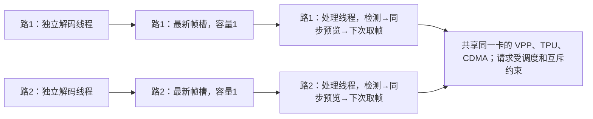

# 32 路并发与 PCIe 2.0 理论时间核验

2026-09-28。针对 [双卡诊断](dual-card-root-cause.md) 中 device 0 的 229.20 FPS、139.471 ms 循环均值展开。上一轮低于 0.11% 的误差验证的是线程计时与完成数的自洽性，不是 PCIe 线速模型对各阶段的预测准确度。

本页保留理论下限与并发口径。后续实际驱动分账和配置干预已完成，见 [VPP 根因报告](../vpp-root-cause.md)；它补充了本文末尾当时尚缺的资源等待证据。

## 每路如何串行、路间如何并发

139.471 ms 是所有正式完成检测的加权均值：`Σ(service_ms.sum + preview_ms.sum) / Σcompleted_measured`，不是每一路、每一帧固定耗时。

| 本轮 PCIe 2.0 通道 | 平均循环 ms | 检测 FPS |
|---|---:|---:|
| CH01 | 136.643 | 7.289 |
| CH02 | 142.296 | 7.022 |
| CH27，循环均值最短 | 135.040 | 7.400 |
| CH26，循环均值最长 | 143.777 | 6.956 |

32 路各自均值约 135.04–143.78 ms，帧数加权平均 139.471 ms；对 32 个均值直接等权平均为 139.506 ms，二者统计权重不同。

现场 config.json 明确为 32 streams、32 slots、64 business_threads、32 model_instances、latest、preview_mode=sync、active_limit=0。

- 每路单个处理线程依次执行预处理、主模型、gate、结果读取、NMS、必要的同步预览，然后再取下一张待检测帧。因此同一路两次检测循环不重叠。
- 同一路解码在另一线程中持续进行，可以与当前检测重叠。`LatestSlot` 用互斥锁与条件变量交换设备图像对象；新帧替换还没被取走的旧帧。两次被选中检测的帧通常不是源视频相邻帧，32×24 FPS 解码不等于全部帧都检测。
- 启动器为每路创建 `std::thread(stream_thread, ...)`，每路处理线程创建自己的解码线程。每卡 32 解码＋32 检测业务线程，另有显示、主线程和 SDK 内部线程等。
- 每路拥有独立 detector/runtime、输入输出缓冲和 gate 状态。每个线程向同一设备提交任务；等待本线程任务完成不会要求其他业务线程停止。主机由 Linux 调度多个线程，而不是给每路分配一个 CPU 核。
- `bmrt_launch_tensor_ex` 提交后立即调用 `bm_thread_sync`，当前处理线程必须等完成才能读取输出；其他线程可提交其请求。卡上硬件任务如何重叠由运行时、固件及硬件安排，本次没有证明 32 个完整模型在同一时刻执行。
- VPP、TPU、CDMA 都是共享资源：线程并发不等于有 32 份硬件。配套 VPP 驱动管理有限名额，CDMA 路径有同设备互斥锁。同一卡上的请求可能排队；不同卡有各自设备资源。

源码位置：`demos/hdmi_wall/main.cpp` 718（独立 detector）、893（解码线程）、923–985（取帧和串行处理）、1107（创建各路线程）；`demos/hdmi_wall/realtime_policy.hpp` 的 `LatestSlot`；`detector/yolov8_det.cpp` 的 `forward`。

用阶段累计线程时间再检查平均有多少处理线程停留在各阶段：`Σ阶段毫秒 / 45000` 得预处理 **13.958**、主模型提交/同步 **5.659**、后处理 **7.878**、同步预览 **4.467**，合计约 **31.96**，其余为微小调用开销。这是平均线程占用位置，不是 VPP/TPU 正在同时执行的任务数。不能假设 32 路一直都在传输，然后固定将 PCIe 带宽除以 32。

## PCIe 2.0 ×1 能推导什么

现场 `lspci`：链路 5 GT/s ×1；**生效 MaxPayload 128 B**，MaxReadReq 512 B。设备支持 MaxPayload 512 B 不表示当前用了 512 B，最大读请求也不是每个数据包的有效载荷。

按 [PCI-SIG 对 Gen2 的说明](https://pcisig.com/how-does-pcie-30-8gts-double-pcie-20-5gts-bit-rate)：

`B = 5×10^9 × (8/10) ÷ 8 = 500,000,000 B/s = 500 MB/s`，为单方向编码后上限。全双工不表示一个方向可以用 1000 MB/s。

按 [AMD/Xilinx WP350](https://docs.amd.com/api/khub/documents/4uw~7uS2eK5x7lKbNdxWlw/content) 的 Gen2 包结构，在不含 ECRC 的条件下，3DW/4DW header 对应合计约 20/24 B 的每包基本开销。这里建立一个明确的**乐观串行化模型**：128 B 包尽量填满，不计管理包、重传、流控停顿、读请求往返、设备/主控处理和 SDK 开销。

`B_payload ≈ 500×128/(128+20～24) = 432.43～421.05 MB/s`。

对单块 B 字节，包数按最少 `ceil(B/128)` 估计：

`t_ms = [B + ceil(B/128)×(20～24)] / 500000`。

这是给定包化假设下的乐观时间，不是实际 SDK 延迟的预测区间，也没有测到总线实际 TLP 数。若实际包更小、传输分段、地址未对齐或有读完成约束，时间还会增加。

## 按相同字节数计算，并补做传输实验

空闲状态下在同一张 device 0、5 GT/s ×1 运行现有 `duplex_probe.pcie`，只进行单线程 D2H。每种大小 2 秒预热＋8 秒正式，正反序各一次；4 档均数据核验通过。视频墙列取前一轮正式窗口。

| 数据 | 字节数 | 仅有效载荷/500 MB/s | 加基本包开销的乐观时间 | 空闲卡纯 D2H 两轮均值 | 视频墙实测 |
|---|---:|---:|---:|---:|---:|
| 每次分数读取 | 33,600 | 0.06720 ms | 0.07772–0.07982 ms | 0.27618 ms | 1.49848 ms |
| 每张预览小图 | 110,592 | 0.22118 ms | 0.25574–0.26266 ms | 0.75245 ms | 1.98957 ms |

纯 D2H 实测吞吐两轮均值分别 121.38、146.83 MB/s。视频墙同尺寸调用墙钟分别为纯 D2H 参考的 **5.43 倍、2.64 倍**。探针是 `bm_memcpy_d2s`；业务是 partial tensor read / image copy，内存状态和主机调度也不同。因此这些倍数说明业务调用的额外成本明显，不能将相减后的差额全部归入某把锁。

每次检测平均结果 118,814.83 B：

- 只计有效载荷：`118814.83/500000 = 0.23763 ms`。
- 近似按满 128 B 包：约 **0.27476–0.28219 ms**。此处是整块近似；实际拆成 1 次分数读取＋约 10.624 次候选区间读取，会增加包边界、提交和同步成本。
- 业务实测读取总墙钟：`1.49848+9.04241 = 10.54089 ms`。

业务读取时间高于乐观线路时间约几十倍。它遵守「实际时间不短于物理下限」的约束，但与「只有有效载荷和基本包头决定耗时」的简化模型明显不符。不能把这几十倍全部称作 PCIe 协议开销，也不能直接将差额解释为可消除的等待。

当前已计数下行 `27.23236+16.81981=44.05217 MB/s`。相对于上述乐观有效带宽约为 10.2%–10.5%，这只是有效载荷与假设上限的比值，**不是实测链路利用率**。尚未覆盖全部控制事务、包形态、突发和流控等，不能证明无任何链路瓶颈；它也不支持「已知结果/小图的平均字节量足以耗尽 500 MB/s」这一解释。

## 为什么不能用 500 MB/s 算出每个阶段

| 原阶段 | 实测平均 | 能否只用 PCIe 参数计算 |
|---|---:|---|
| 预处理 | 60.899 ms/检测 | 不能。主要操作卡内图像，包含 VPP、类型转换、提交和资源等待；不能把卡内图像大小直接当 PCIe 上传量。 |
| 主模型提交与同步 | 24.689 ms/检测 | 不能。输入输出张量驻留卡内，需要模型硬件执行与排队数据；不是逐次把模型权重经 PCIe 传一遍。 |
| 后处理整段 | 34.371 ms/检测 | 只能给其中读取的数据串行化算下限。此处 gate 提交与同步 23.658 ms，结果读取 10.541 ms，还有约 0.172 ms 的 CPU/组织等工作。 |
| 同步预览 | 19.488 ms/检测，摊销 | 每张实际预览约 29.369 ms，其中 VPP 27.278 ms、回传 1.990 ms、其他约 0.101 ms；只有像素回传部分能按 PCIe 字节数估下限。 |

预览生成比例 `6844/10314=0.663564`，因此 `29.369177×0.663564=19.488331 ms/检测`，与上一轮统计吻合。缩图的 27.278 ms 包含排队和控制，不是纯 VPP 硬件执行时间。

更完整的解释模型应为：`API墙钟 = 主机准备 + 资源排队 + 设备/总线服务 + 完成通知与调度`。PCIe 性能参数只能约束其中的线路部分。若要精确推导 60.899 ms 或 27.278 ms，还需要在同一业务窗口测量 VPP 准入、CDMA 等锁与服务时间、控制访问、固件执行及线程唤醒；现有数据不足以唯一拆分这些成分。

## 证据与复算

- 原始视频墙数据：`local/rootcause-20260928/evidence/dual-wall/sync10_device0/worker/summary.json`，以及同目录 config.json。
- 新增传输原始数据：服务器 `data/results/pcie2-small-copy-20260928/`，本地 `local/rootcause-20260928/pcie2-small-copy-20260928/`。命令与结果 JSON 的 SHA256 已与服务端逐一核对。
- 复算：`python3 local/rootcause-20260928/verify_pcie2_theory.py`；结果 `pcie2-theory-verification.json`，含 32 路各自均值、理论时间、两轮探针均值和视频墙参考值。
- 未修改产品代码、驱动、链路速率或 MPS；探针运行结束，设备恢复空闲。
