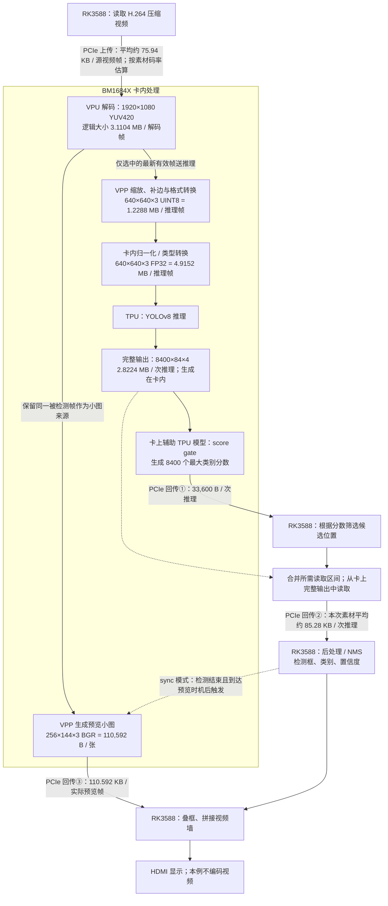

# 视频墙数据流程：每帧大小与 PCIe 回传量

更新：2026-09-24。[返回阅读导航](pcie-reading-guide.md)。

本页标注图像/张量的数据量；主控怎样提交任务、等待完成，另见[各计算单元的PCIe指令流程](pcie-command-flow.md)。

**2.82 MB 是一次推理的完整模型输出张量，不是整个流程的数据量，也不是优化后每次实际回传量。** 本页对应当前 YOLOv8s INT8 batch 1、1080p24 原素材、256×144 BGR 预览、gate64reuse 配置。模型虽然内部量化为 INT8，输入和输出接口仍为 FP32。

单位：KB/MB 均为十进制；108 KiB = 110,592 B。图中卡内数据标注的是图像/张量的逻辑大小，不代表实际分配量、全部内存读写流量或 PCIe 流量。输入解码帧、完成推理帧、完成预览帧的计数不同。

图表示数据依赖，不表示各分支必然同时执行。当前同步预览在本次检测结束后生成对应帧小图；不是每个解码帧都推理，也不是每次推理必然预览。完整输出 F 在优化模式下不整块回传，①＋②为其优化读取路径。

代码核对（2026-09-24）：`Detect` 顺序为预处理、主模型推理、结果读取及CPU后处理；score gate 通过 BMRuntime 启动辅助 TPU 模型并等待完成，主控读取分数后才决定候选位置和合并区间，并非卡上完成整套 NMS。`Thumbnail::render` 对同一被检测帧缩图、回传像素，然后在主控 `cv::rectangle` 叠框，不从主模型输出张量生成图片。图省略了异常时完整回读的 fallback、可能的对齐拷贝及不支持直接YUV时的设备侧BGR桥接，属于当前正常优化路径的数据流，不是所有分支的完整程序调用图。

## 单次回传怎么算

以同卡 PCIe2 x1、32路 sync10 两轮正式窗口为例，按总结果字节数 / 总推理次数计算：

| 项目 | 每次字节数 | 含义 |
|---|---:|---|
| 筛选分数 | 33,600 B | 每次成功 gate 的 8400 个 FP32 分数 |
| 候选内容与合并读取带入的数据 | 平均约 85,276 B | 随画面、候选数量及读取计划变化，不是固定结果大小 |
| 优化结果回传合计 | 平均约 118,876 B，约 0.119 MB | 包含上一行及筛选分数；不是只有最终检测框 |
| 预览小图 | 110,592 B，约 0.111 MB | 仅本次实际生成并回传预览时增加 |
| 结果＋一张小图 | 以平均结果大小估算约 229,468 B，约 0.229 MB | 不是每次推理都发生，也不是这些配对帧单独实测的均值 |
| 不筛选、完整输出回传 | 2,822,400 B，约 2.82 MB | 是替代优化结果回传的另一种模式，不能与①＋②重复相加 |

本次 PCIe2 sync10 实际只有约 74.19% 的推理完成对应一次小图回传。摊到全部推理次数，已计数回传均值约 **0.201 MB / 次推理**；这不同于“每次都带一张图”的约 0.229 MB。两轮总 INF 均值 215.325 FPS，结果约 25.5969 MB/s、小图约 17.6662 MB/s，合计约 **43.2631 MB/s**。

## 上传、卡内大小与未计入部分

- 当前 2400 秒素材经板端 ffprobe 读取：H.264、1920×1080、24 FPS、视频流平均码率 14,579,698 bit/s。平均压缩数据量 = 14,579,698 / 8 / 24 ≈ **75.94 KB / 源视频帧**；I/P/B 帧实际大小不同。这是码率估算，未测每次上传 DMA 字节数，不能直接指定到每次推理。
- 按32路都以24 FPS供源估算，视频有效载荷上传约 **58.32 MB/s**，与正式窗口的实际 DMA 总流量不是同一指标，也不能把它与下行相加后去比较单向带宽。
- 1920×1080 YUV420 的 3,110,400 B 是未压缩、无对齐的逻辑大小。实际解码缓冲可能有 stride、对齐或压缩布局。它驻留卡上，不是每帧上传或回传 3.11 MB。
- 640×640 UINT8 中间图、FP32 输入与完整输出均在卡上生成/使用。它们的尺寸不能相加称为 PCIe 单次开销，也不能当作全部卡内内存带宽消耗。
- VPP 描述符上传、模型执行命令、控制寄存器、SDK其他流量、PCIe包头与链路管理开销未完整计数。模型加载属于初始化，不作为每帧重复传模型的费用。本页没有声称得到全链路精确字节总账。

## 数据依据

- 当前调用顺序与回传：[检测与 score gate 实现](../demos/hdmi_wall/detector/yolov8_det.cpp)；最新帧选择、同步预览、像素回传及主控叠框：[视频墙实现](../demos/hdmi_wall/main.cpp)。
- [同卡同插槽对照](same-card-link-20260923.md)：32路 none/sync10 的实际结果/小图回传量。原始 `data/results/same-card-link32-20260923/analysis.json` 中 PCIe2 两轮计算，原始文件按该报告已完成 SHA 校验。
- [计算口径](performance-calculations.md)、[原模型探针说明](../demos/hdmi_wall/docs/capacity-validation.md)：FP32 输入/输出边界；原始 `data/results/readback-20260922/inference/r0_compute_0/result.json` 记录 input_bytes=4,915,200、output_bytes=2,822,400。该探针 config.json 与本次同卡四批 preflight.json 的模型 SHA256 均为 `b09b7c5bc0a8c18c67f839c33551ba35fa37748d10eafb6a8f9d41ee87f086b4`，已核对为同一模型文件。
- [回传优化](readback-performance.md)：score gate、合并读取及缓冲复用；[根因报告](preview-root-cause-20260923.md)：VPP准入与共享CDMA路径，以及尚未量化的等待机制。
