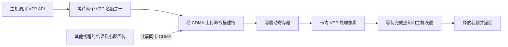

# 预处理为何受 PCIe 影响：调用分账与证据边界（2026-09-28）

后续已完成更细的[驱动对应与等待分账](vpp-attribution-20260928.md)：定位到 VPP 名额等待，并发现此前未纳入账目的逐解码帧 VPP 解压请求。本页保留前一轮方法、数据和当时的证据边界。

最终因果验证与可采用的解码配置见 [VPP 根因报告](vpp-root-cause.md)。

用户的质疑成立：图像像素留在 BM1684X 上处理，不能因为 PCIe 2.0 比 3.0 慢，就把 60.899 / 18.470 ms 解释为卡内计算慢了 3.30 倍。原指标是主机从进入 `pre_process` 到返回的墙钟时间，包括 SDK、驱动、资源等待、命令提交、硬件执行和完成通知。没有逐帧完整图像往返，不等于没有 PCIe 控制交互。

**这次补测把差距定位到预处理的两次 VPP 路径调用，但没有把两卡全部时间差定量归因到某一把锁。** 已有源码、历史实际等待案例及同卡变速实验支持控制/共享资源干扰机制；它们不能替代本轮的完整驱动内部分账。

## 真实视频墙补测

仍为双卡同时各 32 路、原模型/素材/二进制、结果回传、同步预览上限 10 FPS。每档预热 30 秒、正式 60 秒，顺序为原程序→仅加 API 计时→原程序。

临时 `LD_PRELOAD` 观察器只包装 `bmcv_image_vpp_basic` 和 `bmcv_image_convert_to`，参数、调用顺序及返回值原样传递。每线程内存记录时间戳，退出后才写 CSV；不替换业务二进制、不启用内核函数追踪。正式窗口只选完整的“VPP basic→convert_to”调用对，并与应用原有预处理计时核对。

| 主机墙钟均值，ms | PCIe 2.0 ×1 / device 0 | PCIe 3.0 ×1 / device 2 | 差值 |
|---|---:|---:|---:|
| 缩放、颜色转换、letterbox：`vpp_basic` | 31.571939 | 8.797878 | 22.774061 |
| 归一化、类型转换：`convert_to` | 32.363510 | 10.795951 | 21.567559 |
| 两次调用间隔 | 0.001889 | 0.001945 | −0.000056 |
| 完整调用对累计 | **63.937338** | **19.595775** | **44.341564** |
| 应用原有预处理计时 | **63.953162** | **19.599152** | **44.354010** |

两种计时口径的差仅 0.015823 / 0.003377 ms，约 0.0247% / 0.0172%。这既有函数外层少量工作，也有窗口边界样本差异，不能将差额全部指定为某项开销。观察器以两次调用完整落在窗口内选样；原程序以整帧完成时间选样。

正式完整调用对分别 13,311 / 16,279，均覆盖 32 个推理线程。全部观察事件返回成功，无记录丢失。同期预览小图 VPP 调用均值 29.364866 / 9.290506 ms，与应用计时 29.376816 / 9.292899 ms 也吻合。

这是**新一轮实测**，不能把其 63.95 / 19.60 ms 替换为前一轮 60.90 / 18.47 ms，或者声称新轮恰好分解了旧轮的每一个样本。

| 对照轮 | PCIe 2.0 FPS / TPU | PCIe 3.0 FPS / TPU |
|---|---:|---:|
| 前置原程序 | 224.267 / 81.467% | 271.600 / 99.367% |
| 加 API 计时 | 222.350 / 81.267% | 271.317 / 99.700% |
| 后置原程序 | 226.500 / 83.200% | 271.300 / 99.400% |

计时轮相对前后 FPS 均值低 1.346% / 0.049%，没有看到足以解释约三倍 API 耗时差的扰动；不能据一轮对照宣称完全无扰动。全部阶段 32 路均持续有结果，最长间隔分别不超过 0.269 / 0.255 秒。计时轮 device 2 有 9 次全运行过期丢帧，其余为 0；不隐去此异常，也不将它解释为正式窗口内逐帧完整定位。

## 实际执行和等待在哪里

业务 [yolov8_det.cpp](../demos/hdmi_wall/detector/yolov8_det.cpp) 中，预处理依次做 1080p→640×640 RGB U8，以及 RGB U8→模型输入类型的线性转换。缓冲已复用；1920 像素宽也不进入 64 对齐补拷贝分支。输入、中间图像和模型张量都在设备内存中。

厂商说明 [`vpp_basic`](https://doc.sophgo.com/sdk-docs/v22.12.01/docs_latest_release/docs/bmcv/reference/html/api/vpp_basic.html) 使用芯片上的 VPP 完成缩放、颜色转换和 padding；[`convert_to`](https://doc.sophgo.com/sdk-docs/v23.10.01/docs_latest_release/docs/bmcv/reference/html/api/convert_to.html) 执行像素线性变换。

进一步核对**现场已安装** `libbmcv.so.0` 反汇编：`bmcv_image_convert_to` 的芯片 0x1686、输入 `DATA_TYPE_EXT_1N_BYTE` 分支调用 `bm1684x_vpp_convert_to`（地址 0x4ab04）。业务创建的 resized image 正是此类型。因此本次第二步也走 VPP 路径；不能泛称所有数据类型的 convert_to 都使用同一后端。

配套驱动 `vpp/bm1686_vpp.c` 的顺序为：

具体源码顺序：`down_interruptible(vpp_core_sem)` → `vpp_prepare_cmd_list` → `bmdev_memcpy_s2d_internal` → `vpp_setup_desc` → `wait_event_timeout` → 释放名额。CDMA 路径有同设备 `cdma_mutex`，取得锁后还处理设备侧 CDMA 锁、寄存器和传输完成。

所以一个 VPP 请求**取得名额后，可能还在等 CDMA，并未开始处理像素**。这期间其他 VPP 请求可以继续排队。另一线程正在回传结果时，会影响当前线程看到的预处理 API 时间，尽管当前预处理图像没有经过 PCIe。两张卡不是共用这一把锁；TPU 消息 FIFO 也不能一概归入此锁。

## 命令传输量不能直接解释几十毫秒

对现场驱动头文件编译 `sizeof(descriptor)`，结果为 **336 B**。驱动上传大小为 `batch->num × sizeof(descriptor)`；没有测量本轮所有调用的实际 batch 数，因此以下只计算**一个描述符**。

[PCI-SIG 编码规则](https://pcisig.com/how-does-pcie-30-8gts-double-pcie-20-5gts-bit-rate)给出 PCIe 2.0 的 8b/10b 与 3.0 的 128b/130b 编码。

- PCIe 2.0 ×1：`5×10^9×8/10÷8 = 500,000,000 B/s`；336 B 的理想序列化时间 `336/500,000,000 = 0.672 µs`。
- PCIe 3.0 ×1：`8×10^9×128/130÷8 = 984,615,385 B/s`；对应 **0.34125 µs**。

这两个数不含协议包开销、命令往返、DMA 建立、锁、CPU 调度和设备执行，绝不是 API 理论耗时。它们反而说明：**不能拿“命令有 PCIe 传输”直接解释 20–40 ms 差额；必须测排队、控制和同步过程。**

历史实际函数图存在一个完整 VPP 调用（device 2 降到 5 GT/s 的混合业务，TID 21610）：

| 单次调用分段 | ms |
|---|---:|
| 等 VPP 名额 | 1.788208 |
| 描述符上传整段，含 CDMA 等待 | 9.865042 |
| 启动后完成等待 | 1.428000 |
| 其他 | 0.042870 |
| 合计 | **13.124120** |

其中描述符上传里的 `cdma_mutex` 调用耗时 **9.755375 ms**，是 9.865042 的子项，不能重复相加。等名额与该锁调用合计 `(1.788208+9.755375)/13.124120 = 87.957%`。这证明实际发生过“长时间等待而非一直计算”；但只是一个有函数图扰动的历史调用，不能当作今天所有帧的平均比例，也不能将 1.428 ms 完成等待视为纯硬件执行时间。完整原始片段与解析结果已重新取回、复算；历史追踪质量限制见 [驱动等待报告](pcie-dispatch-wait.md)。

## 不能单看预处理均值判断 TPU 是否会空闲

同一天此前的 PCIe 2.0 对照：

| 场景，结果仍回传 | 预处理 ms | 总检测 FPS | TPU |
|---|---:|---:|---:|
| 同步预览上限 10 | 60.899 | 229.200 | 84.311% |
| 不生成预览 | 47.770 | 273.378 | 99.333% |
| 异步预览上限 3 | 64.416 | 270.178 | 99.022% |

异步预览后预处理调用反而略长，TPU 却接近满载。32 路可以同时等待，单路 API 墙钟不等于整卡服务时间。判断供给是否中断，需要看完整依赖关系、队列和吞吐；不能要求每个阶段均值都变小才算优化。

原两卡循环均值之差也不是 42.429 ms：预处理 `+42.429`、主模型提交与同步 `−19.898`、后处理 `−13.117`、同步预览摊销 `+12.371`，合计约 **+21.784 ms**。等待在不同阶段重新分布，不能把这些 API 均值都当作硬件独立计算成本。

已经验证的应用层缓解是降低预览频率并异步处理，可恢复约 270 FPS / 99% TPU，但降低了预览帧率。若要保持原预览目标，应继续评估合并两步 VPP、减少重复缩图和结果回传交互，并进行正确性及吞吐验证；当前没有实施这些改动，也没有证明修改某把驱动锁就是正确修复。

## 复核资料

- 本地原始计时、对照及脚本：`local/rootcause-20260928/preprocess-split/`、`preprocess_timing.cpp`、`preprocess_split_probe.py`。
- 重算：`python3 local/rootcause-20260928/analyze_preprocess_split.py`，输出 `preprocess-split/api-analysis.json`。
- 现场库反汇编及哈希：`local/rootcause-20260928/installed-convert-to-disasm.txt`。库 SHA256：`01b15f8fddc2ff006ab696377eb98e64bc04232cc42752086a32716f6004627d`。
- 驱动副本：`driver-vpp.c`、`driver-vpp.h`、`driver-cdma.c`；命令大小探针：`descriptor_size.cpp`。
- 历史单次完整调用：`historical-vpp-one-call.trace`、`historical-vpp-one-call.json`。
- 原始归档 `preprocess-split-evidence.tar.gz` 两端 SHA256 一致：`e17cb05d2d8635d2d509b5645c7af5840b68efc49866ab9c08b004d9195ba94a`。
- 服务器原始目录：`/userdata/1684X-EP-demo/data/results/rootcause-20260928/preprocess-split`。

实验结束已确认三卡 TPU 0%，device 0 / 2 仍分别为 5 / 8 GT/s。本轮没有改变链路、驱动、业务代码或默认配置。
