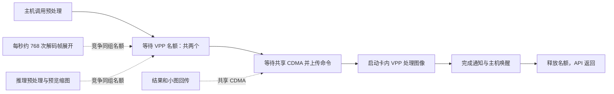

# 1684X 预处理耗时差异：根因、计算与验证

当前使用入口：线性输出＋8 块额外缓冲已接入正式 showcase 默认配置，见[运行配置与验收](../demos/hdmi_wall/docs/linear-materials.md)。本文保留接入前的诊断方法与原始实验条件。

2026-09-28，服务器 `192.168.5.44`，项目 `/userdata/1684X-EP-demo`。本文汇总本次诊断；原始阶段报告和失败配置均保留，不将后续观察改写成先前已经知道的事实。

## 结论与正确的计时口径

图像预处理确实在 1684X 的 VPP 上运行，图像像素驻留设备内存。**60.899 ms 与 18.470 ms 是主机预处理调用的墙钟时间，不是 VPP 对图像进行计算的纯时间。** 不能把倍率解释为 PCIe 2.0 卡的图像计算慢 3.3 倍，也不能拿整幅图像大小除以 PCIe 带宽解释这两个数。

本次定位的主要机制是：OpenCV 对每一张压缩布局解码帧先作 VPP 展开，32 路合计约 768 次/秒，之后应用才选择最新帧推理；大量最终不会推理的帧已经消耗 VPP。推理两步预处理和同步预览也使用同一组 VPP 名额。VPP 驱动先取得名额，再走与回传共享的 CDMA 命令路径；PCIe 2.0 混合负载中这段等待更长，使名额释放变慢，接近饱和的队列把小的服务时间差放大成几十毫秒的 API 等待，进而使 TPU 输入供给不足。

当前压缩输出路径为：H.264 码流 → VPU 视频解码 → 已解码的压缩布局帧 → VPP 布局展开 → 线性 YUV。视频编码压缩和解码后的像素存储布局是两个层次；两张卡执行相同路径。后面的布局展开不是再次进行 H.264 视频解码。

“像素在卡上”排除了每次整图主机往返，但没有排除命令提交、寄存器控制、完成通知及资源争用。驱动顺序可核对：



两个名额管理的是从提交到完成的整段过程，不只管理“硬件已经开始计算”的时间。现场驱动副本 `local/rootcause-20260928/driver-vpp.c` 第 401 行取得名额，第 413 行附近准备命令，第 427 行等待完成；命令上传在第 332 行。`driver-cdma.c` 第 73 行取得同设备 `cdma_mutex`。不同卡不是共用这把锁。

## 直接测量：几十毫秒差异主要发生在哪里

在双卡各 32 路、同步预览上限 10 FPS 的真实业务中，用线程 ID、调用 ID、父调用 ID 和单调时钟对应 API、驱动提交和内核函数图。

未开启内核追踪的 90 秒窗口，PCIe 2.0 的两步 API 均值为 32.109＋32.779 ms，驱动提交为 32.092＋32.761 ms；PCIe 3.0 为 9.485＋11.305 ms，驱动提交为 9.468＋11.288 ms。API 外层准备平均只有约 0.017 ms/次。每次均为一个 VPP 请求、一个描述符。

第二段 8 秒内核捕获的“两步请求均值之和”，单位 ms：

| 阶段 | PCIe 2.0 | PCIe 3.0 | 差值 |
|---|---:|---:|---:|
| 等待 VPP 名额 | 68.777 | 26.135 | **42.642** |
| 取得名额后 CDMA 锁调用 | 0.460 | 0.262 | 0.198 |
| CDMA 及描述符路径其他工作 | 0.440 | 0.519 | −0.079 |
| 启动后的完成等待 | 1.816 | 1.942 | −0.126 |
| 其他 | 0.066 | 0.060 | 0.006 |
| **总计** | **71.560** | **28.918** | **42.641** |

总差 42.641 ms，名额等待差 42.642 ms，其余项大体抵消。另一次捕获总差 33.504 ms、名额等待差 33.586 ms，结论相同。完成等待没有出现约三倍差异。完成等待仍包含通知和调度，不能将 1.816 / 1.942 ms 当成精确的 VPP 纯计算时间。

这两段捕获的完整调用对应率为 99.73% / 99.58%，无负分段时间、无完整根无法匹配、各 CPU 追踪缓冲 overrun/dropped 均为 0。内核追踪使 PCIe 2.0 吞吐降低约 3.7%，因此这是新窗口的机制定位，不能把该比例原样套回最初 229.2 FPS 的全部样本。完整分账与限制见 [阶段证据报告](vpp-attribution-20260928.md)。

## 为什么 VPP 会排这么长的队

实际调用栈定位到了以下路径：

```text
VideoCapture::read / retrieve
→ cv::bmcv::decomp
→ bmcv_image_vpp_csc_matrix_convert
→ bm_trigger_vpp
```

现场已安装库反汇编、真实调用栈和参数覆盖日志共同验证此路径。[Sophgo OpenCV 公开源码](https://github.com/sophgo/sophon_opencv/blob/master/modules/videoio/src/cap_ffmpeg_impl.hpp)也包含压缩布局帧的 `decomp`，以及 `output_format=101` / 额外缓冲数 2 的设置。公开分支用于说明实现机制，不视为现场二进制的精确构建版本。

32 路各 24 FPS，预计 `32×24=768` 次展开/秒；未追踪窗口实测 **767.544 / 768.000 次/秒**。另有推理预处理及缩图 **597.589 / 739.544 次/秒**。原本只数检测帧和预览帧，会漏掉每卡多数 VPP 请求。

第一段捕获中，每次解压取得名额后的驱动时间为 **1.5041 / 1.2195 ms**，其中 CDMA 锁调用 **0.2633 / 0.0572 ms**，启动后完成等待 **1.0507 / 1.0470 ms**。因此主要额外成本在实际计算前；它还占着 VPP 名额。

仅这一固定背景负载，两卡每秒名额预算差就约为：

`768×(1.5041−1.2195) ≈ 218.6 名额毫秒/秒`。

其中 CDMA 锁调用的增量约 `768×(0.2633−0.0572)=158.3 名额毫秒/秒`。这是累计占用的量纲，不是把所有线程墙钟相加当成机器运行时间，也不是证明每一微秒都来自线路传输。

两个名额每秒共 2000 名额毫秒。该捕获 PCIe 2.0 解码背景先占约 `768×1.5041=1155.2`，余约 844.8；PCIe 3.0 余约 1063.4。看似每请求仅约 0.285 ms 的差别，使 PCIe 2.0 留给检测及预览的预算少约 **20.6%**。

再加入测得的两步预处理和预览服务时间，PCIe 2.0 的条件吞吐上界为：

`(2000−768×1.5041)/(1.3340+1.3761+0.7380×1.5090) ≈ 220.95 FPS`。

该捕获实际 209.70 FPS，低于上界约 5.1%；另一段算得 219.29，实测 208.12。PCIe 3.0 相同计算约 289.74 / 292.26 FPS，已超过完整工作流约 272–278 FPS 的 TPU 吞吐范围。

这是用实测服务时间建立的资源预算一致性检查，含少量名额外工作与追踪扰动；不是只靠 PCIe 规格独立预测 229 FPS。模型、输入和每项假设保存在 `verify_vpp_pool_model.py` / `vpp-pool-model.json`。

## PCIe 理论数值核算能排除什么

按 [PCI-SIG 编码规则](https://pcisig.com/how-does-pcie-30-8gts-double-pcie-20-5gts-bit-rate)：

| 项目 | PCIe 2.0 ×1 | PCIe 3.0 ×1 |
|---|---:|---:|
| 编码后单向上限 | `5e9×8/10÷8=500 MB/s` | `8e9×128/130÷8≈984.615 MB/s` |
| 一个 336 B VPP 描述符的理想序列化时间 | **0.672 µs** | **0.341 µs** |

描述符尺寸来自现场配套头文件，全部正式观察到的请求均为一个描述符。即使加基本包头，命令有效载荷本身也不能解释约 40 ms 的差值。PCIe 的影响主要通过实际驱动交互、共享 DMA 和队列传播；不能把锁等待统称为 PCIe 协议开销。

原视频墙已计数结果及小图下行合计只有 44.05 MB/s，也不支持“这些数据量已经耗尽 500 MB/s”这一说法。更多结果大小、分段调用次数与空闲 D2H 对照见 [PCIe 理论核验](pcie2-theory-and-concurrency.md)。

## 因果干预：去掉隐藏工作是否恢复性能

临时诊断进程将解码输出从压缩布局 101 改为线性布局 0，`zero_copy` 保持原值。没有换模型、减少检测、关闭结果回传或降低同步预览的 10 FPS 上限。单路固定源帧 0–239 的检测类别、坐标、分数 **240/240 完全一致**；额外解压请求从 240 次降为 0。该检查不等同于所有像素和所有码流的正确性证明。

默认额外缓冲数 2 时，线性输出虽恢复约 276 FPS / 99.9% TPU，却出现大量过期丢帧和长结果空窗，不能直接作为修复。线性帧会被下游持有，增加到 8 个额外缓冲后复测如下，两卡同时各 32 路，每档预热 30 秒、正式 60 秒：

| 配置，均为额外缓冲 8 | PCIe 2.0 FPS / TPU | PCIe 3.0 FPS / TPU |
|---|---:|---:|
| 线性，第 1 轮 | 273.67 / 98.70% | 277.73 / 100% |
| 恢复压缩，对照 | 228.55 / 83.00% | 272.37 / 99.63% |
| 线性，第 2 轮 | 272.92 / 97.43% | 277.93 / 100% |

两轮线性均值 **273.29 / 277.83 FPS**，差距收敛到 **1.635%**。PCIe 2.0 相对同组压缩提高 **19.576%**。全部阶段过期丢帧为 0，32 路均有结果；线性 PCIe 2.0 最大结果空窗为 0.282 / 0.277 秒，采样最大解码源滞后 52.8 / 54.0 ms。实际预览由压缩的 4.756 提高到平均 5.367 FPS/路，故收益并非来自偷偷降低预览频率。

PCIe 3.0 也受到布局展开的影响：移除后预处理调用均值从 **18.365 降至 5.249 ms**，实际预览从 **6.165 升至 7.667 FPS/路**，提高约 **24.37%**；检测吞吐则提高约 **2.01%**。原双卡负载中 TPU 已接近满载，VPP 仍能持续供给，所以减少 VPP 工作对检测吞吐的增益较小。32 路并发时，一路等待不代表其他路不能让 TPU 工作；不能将“存在开销”等同于“它是当前吞吐瓶颈”，也不能声称 PCIe 3.0 完全不受影响。

### 同一张卡的 8→5→8 GT/s 交叉验证

只运行 device 2，其余卡空闲；同卡同槽、同二进制、32 路、额外缓冲 8、同步预览上限 10。每档 30 秒预热＋60 秒正式，链路实读均为 ×1。

| 链路顺序 | 压缩布局 FPS / TPU | 线性布局 FPS / TPU |
|---|---:|---:|
| 起始 8 GT/s | 262.87 / 95.73% | 278.10 / 99.90% |
| 降为 5 GT/s | 212.67 / 77.13% | 273.02 / 97.87% |
| 恢复 8 GT/s | 258.68 / 94.20% | 278.35 / 99.90% |

相对于前后两次 8 GT/s 均值，5 GT/s 的损失在压缩布局为 **18.448%**，在线性布局为 **1.872%**。同一张卡也能复现明显下降并在回切后恢复；去掉逐解码帧 VPP 展开后，对速率的敏感度显著下降。物理卡个体差异无法解释这一组结果。

全部六档 32 路均有检测、过期丢帧为 0。此实验与双卡并行是不同负载，绝对 FPS 不合并统计；单卡 8 GT/s 的压缩布局也没有始终达到 TPU 100%，不能宣称只有 PCIe 2.0 才受这套数据路径影响。

结束后实读 device 2 恢复 **8.0 GT/s ×1**、root port target 为 `0003`；设备 0/1 保持 5.0 GT/s ×1。追踪器为 `nop`，业务二进制 SHA256 与实验前相同，无诊断业务进程，三卡 TPU 均为 0%。原始归档 `samecard-format-evidence.tar.gz` 两端 SHA256：`cb3e1315fefce1c011b2d6a1adeb779fd4a043141b5039e3958e57209a09c041`。

## 可采用的解决方式和验证边界

当前有短时重复数据支持的方案是：**解码线性输出 `output_format=0`，并为当前 32 路工作流配置足够的解码缓冲；本次有效配置为 `extra_frame_buffer_num=8`。** 这直接去掉每卡约 768 次/秒不必要的 VPP 展开，保留原结果回传与同步预览上限。

诊断通过进程内参数包装器证明效果，没有将 `LD_PRELOAD` 钩子部署为生产方案。正式实现应让解码接口可靠地传入上述参数并管理帧的生命周期；现场 OpenCV 路径会硬编码参数，不能只建议设置一个可能被覆盖的环境变量。缓冲从 2 增至 8，每卡按未对齐 1080p YUV420 帧估计额外约 `6×32×1920×1080×1.5≈597 MB`，实际分配需按 SDK 对齐与引用帧需求测量。

另一种架构方案是保留压缩布局，先选择要检测的帧，再将展开和缩放合并；它可能避免全部解码帧都先展开，但本次没有实现或测得收益。原异步 3 FPS 预览方案也有效，但会降低预览上限，不是本次线性方案的性能来源。

已验证的是这份素材、模型、32 路和短时重复窗口下的主要性能缺口；仍有约 1.6% 吞吐差，不能承诺所有业务恒定 100% TPU。长期运行、RTSP 重连、EOF 循环、其他分辨率与不同码流未作生产验收。当前工作是诊断与方案验证，没有改变业务默认配置。

## 审计与重算

阶段方法及追踪排除记录见 [详细证据](vpp-attribution-20260928.md)。本地全部原始数据在 `local/rootcause-20260928/`；服务器对应目录为 `/userdata/1684X-EP-demo/data/results/rootcause-20260928/`。原始归档、SHA256、分析入口和失败配置见 [证据索引](vpp-evidence-index.md)，原数据目录也保留 `EVIDENCE-INDEX.md`。Git 中保存了[当时的源码与选定摘要快照](../tools/diagnostics/studies/rootcause-20260928/README.md)。重算结果 `final-verification.json` 同时保存输入文件 SHA256。
